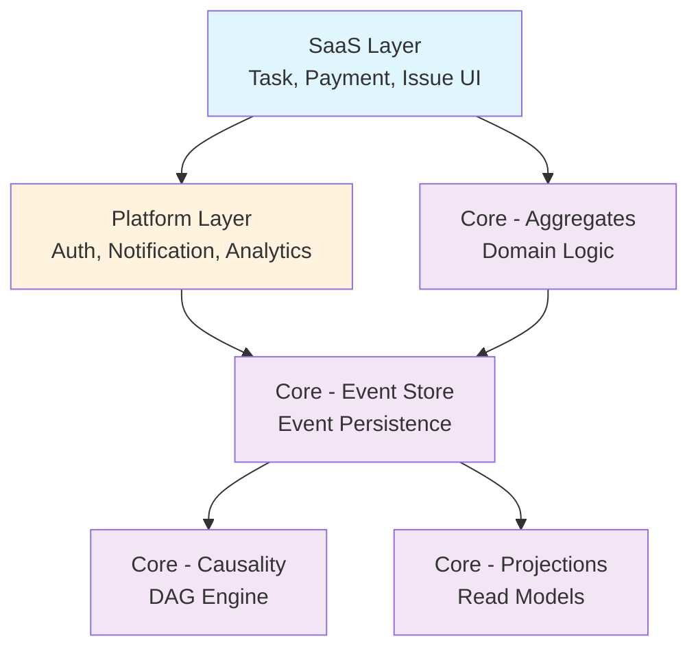
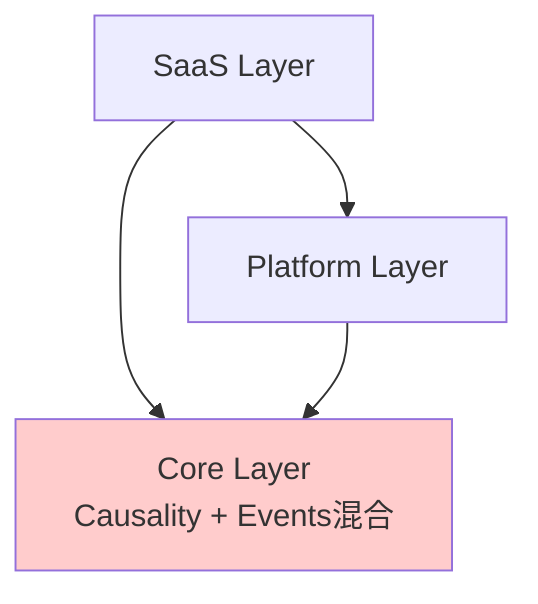

# Directory Structure Comparison: Causality-Driven Event-Sourced System

## 🎯 Problem

正在設計 Angular 的 Causality-Driven Event-Sourced Process System
需要決定目錄結構：
1. 三個獨立文件夾？
2. 合併的 core 文件夾？

## 📊 Structure Comparison

### ✅ OPTION 1: Three Separate Folders (RECOMMENDED)

```
src/app/
│
├─── saas/              # 🏢 SaaS Layer (面向用戶的 SaaS 層)
│    ├── task/          #    任務管理模組
│    ├── payment/       #    請款管理模組
│    ├── issue/         #    問題追蹤模組
│    └── blueprint/     #    租戶配置模組
│
├─── platform/          # 🔧 Platform Layer (開放的基礎架構平台)
│    ├── auth/          #    身份驗證與授權
│    ├── notification/  #    通知服務
│    ├── analytics/     #    分析整合
│    └── adapter/       #    外部系統適配器
│
└─── core/              # ⚙️ Core Layer (核心層)
     │
     ├── causality/     # 🔗 因果驅動核心 (Causality-Driven Core)
     │   ├── dag.engine.ts           # DAG 構建引擎
     │   ├── causality.validator.ts  # 因果關係驗證
     │   └── causality.service.ts    # 因果查詢服務
     │
     ├── event-store/   # 📚 事件溯源核心 (Event-Sourced Core)
     │   ├── event-store.service.ts  # 事件存儲
     │   ├── event.interface.ts      # 事件接口
     │   └── event-bus.service.ts    # 事件總線
     │
     ├── aggregate/     # 🎯 領域聚合根
     │   ├── task.aggregate.ts       # 任務聚合
     │   ├── payment.aggregate.ts    # 請款聚合
     │   └── issue.aggregate.ts      # 問題聚合
     │
     └── projection/    # 📊 讀模型投影
         ├── task-list.projection.ts
         ├── payment-summary.projection.ts
         └── causality-graph.projection.ts
```

**Why This Is Best:**

| Aspect | Benefit |
|--------|---------|
| 🎯 **職責分離** | 每層都有明確的單一職責 |
| 👥 **團隊協作** | 不同團隊可以獨立工作在不同層 |
| 📦 **可重用性** | Core 和 Platform 可提取為 npm 包 |
| ⬇️ **依賴方向** | 強制單向依賴 (SaaS → Platform → Core) |
| 🔧 **易於測試** | 層邊界使測試隔離更容易 |
| 📈 **可擴展性** | 添加新功能不會影響 Core |

### ❌ OPTION 2: Combined Core (NOT RECOMMENDED)

```
src/app/
│
├─── saas/
│    ├── task/
│    ├── payment/
│    ├── issue/
│    └── blueprint/
│
├─── platform/
│    ├── auth/
│    ├── notification/
│    ├── analytics/
│    └── adapter/
│
└─── core/              # ⚠️ Combined (混合的 core)
     ├── causality/     # 因果驅動
     ├── event-store/   # 事件溯源
     ├── aggregate/
     └── projection/
```

**Why Not Recommended:**

| Issue | Impact |
|-------|--------|
| 🔀 **混合關注點** | Causality 和 Event-Sourcing 混在一起 |
| 🤔 **不清晰** | 難以理解哪個部分負責什麼 |
| 📚 **難以提取** | 將來很難提取為獨立的庫 |
| 🏗️ **架構意圖** | 架構邊界不夠明確 |

## 🔄 Dependency Flow

### Option 1 (Recommended) - Clear Layers



**Benefits:**
✅ 清晰的依賴方向
✅ 易於理解和維護
✅ 可以獨立測試每一層

### Option 2 - Mixed Dependencies



**Issues:**
❌ Core 職責不清晰
❌ 難以單獨測試
❌ 難以提取為庫

## 📁 Detailed File Organization (Option 1)

### SaaS Layer Structure

```
saas/
├── task/
│   ├── components/           # UI 組件
│   │   ├── task-list/
│   │   ├── task-detail/
│   │   └── task-form/
│   ├── services/             # 業務邏輯服務
│   │   └── task.service.ts
│   └── models/               # UI 模型
│       └── task-ui.model.ts
│
├── payment/
│   ├── components/
│   ├── services/
│   └── models/
│
└── issue/
    ├── components/
    ├── services/
    └── models/
```

### Platform Layer Structure

```
platform/
├── auth/
│   ├── guards/               # 路由守衛
│   ├── services/             # 認證服務
│   └── models/               # 認證模型
│
├── notification/
│   ├── services/
│   └── models/
│
└── adapter/
    ├── payment-gateway/      # 支付網關適配器
    ├── invoice-system/       # 發票系統適配器
    └── base/                 # 基礎適配器
```

### Core Layer Structure

```
core/
├── causality/               # 🔗 因果驅動核心
│   ├── dag.engine.ts        #    DAG 構建引擎
│   ├── causality.validator.ts
│   └── causality.service.ts
│
├── event-store/            # 📚 事件溯源核心
│   ├── event-store.service.ts
│   ├── event.interface.ts
│   ├── event-bus.service.ts
│   └── event-metadata.ts
│
├── aggregate/              # 🎯 聚合根
│   ├── base/
│   │   └── aggregate-root.ts
│   ├── task.aggregate.ts
│   ├── payment.aggregate.ts
│   └── issue.aggregate.ts
│
└── projection/             # 📊 投影
    ├── base/
    │   └── projection-engine.ts
    ├── task-list.projection.ts
    ├── payment-summary.projection.ts
    └── causality-graph.projection.ts
```

## 🚀 Migration Path

### Phase 1: Basic Structure
```bash
# 創建基礎結構
mkdir -p src/app/{saas,platform,core}
mkdir -p src/app/saas/{task,payment,issue,blueprint}
mkdir -p src/app/platform/{auth,notification,analytics,adapter}
mkdir -p src/app/core/{causality,event-store,aggregate,projection}
```

### Phase 2: Implement Core
```bash
# 實現事件存儲
touch src/app/core/event-store/event-store.service.ts
touch src/app/core/event-store/event.interface.ts

# 實現因果引擎
touch src/app/core/causality/dag.engine.ts
touch src/app/core/causality/causality.service.ts
```

### Phase 3: Build Aggregates
```bash
# 實現聚合根
touch src/app/core/aggregate/task.aggregate.ts
touch src/app/core/aggregate/payment.aggregate.ts
```

### Phase 4: Add SaaS Features
```bash
# 實現 SaaS 功能
touch src/app/saas/task/services/task.service.ts
touch src/app/saas/task/components/task-list/task-list.component.ts
```

## 📊 Comparison Table

| Criteria | Option 1 (3 Folders) | Option 2 (Combined) |
|----------|---------------------|---------------------|
| **清晰度** | ✅ Very Clear | ⚠️ Mixed |
| **可維護性** | ✅ High | ⚠️ Medium |
| **團隊協作** | ✅ Excellent | ⚠️ Average |
| **可重用性** | ✅ Easy to extract | ❌ Difficult |
| **依賴管理** | ✅ Enforced | ⚠️ Manual |
| **測試隔離** | ✅ Easy | ⚠️ Harder |
| **學習曲線** | ⚠️ Slightly steeper | ✅ Simpler initially |
| **長期維護** | ✅ Excellent | ⚠️ Challenging |

## ✅ Final Recommendation

### Use Option 1: Three Separate Folders

**理由 (Reasons):**
1. 🎯 最清晰的架構邊界
2. 👥 最佳的團隊擴展性
3. 📦 最容易提取為庫
4. ⬇️ 強制正確的依賴方向
5. 🔧 最易於長期維護

**適用場景 (When to Use):**
- ✅ 生產級應用
- ✅ 多團隊協作
- ✅ 長期維護項目
- ✅ 需要清晰架構的系統

**不適用場景 (When NOT to Use):**
- ❌ 快速原型（可以先用 Option 2，後續重構到 Option 1）
- ❌ 概念驗證項目

## 📚 Related Documentation

- **Complete Architecture**: See `ng-events_Architecture.md`
- **Quick Start**: See `ARCHITECTURE_SUMMARY.md`
- **Event Design**: See `123.md` and `456.md`

---

**Recommendation**: ✅ **Option 1 - Three Separate Folders**
**Status**: Ready for Implementation
**Date**: 2026-01-01
