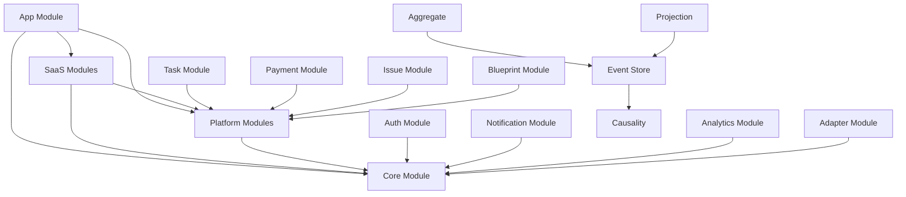

# Final Implementation Directory Tree (最終實作目錄樹)

> **Document Purpose (文檔目的)**: 完整的生產就緒目錄結構，用於實際落地實作

---

## 📋 Overview (概覽)

本文檔提供 **Causality-Driven Event-Sourced Process System** 的完整實作目錄結構。

**特點:**
- ✅ 基於 Architecture-Specification(架構規範).md
- ✅ 三層架構: SaaS → Platform → Core
- ✅ 支援多租戶隔離 (blueprintId)
- ✅ Event-Sourcing + Causality 完整實作
- ✅ 生產就緒，可直接落地使用

---

## 🏗️ Complete Directory Structure (完整目錄結構)

```
ng-events/
├── src/
│   └── app/
│       ├── saas/                                    # 🏢 SaaS Layer - User-facing features
│       │   ├── task/                                # 任務管理 (Task Management)
│       │   │   ├── components/
│       │   │   │   ├── task-list/
│       │   │   │   │   ├── task-list.component.ts
│       │   │   │   │   ├── task-list.component.html
│       │   │   │   │   └── task-list.component.scss
│       │   │   │   ├── task-detail/
│       │   │   │   │   ├── task-detail.component.ts
│       │   │   │   │   ├── task-detail.component.html
│       │   │   │   │   └── task-detail.component.scss
│       │   │   │   ├── task-create/
│       │   │   │   │   ├── task-create.component.ts
│       │   │   │   │   ├── task-create.component.html
│       │   │   │   │   └── task-create.component.scss
│       │   │   │   └── task-kanban/
│       │   │   │       ├── task-kanban.component.ts
│       │   │   │       ├── task-kanban.component.html
│       │   │   │       └── task-kanban.component.scss
│       │   │   ├── services/
│       │   │   │   ├── task.service.ts             # Task business service
│       │   │   │   └── task-query.service.ts       # Read model queries
│       │   │   ├── models/
│       │   │   │   ├── task.model.ts               # Task DTO
│       │   │   │   └── task-view.model.ts          # Task view model
│       │   │   ├── routes/
│       │   │   │   └── task.routes.ts              # Task routing
│       │   │   └── task.module.ts
│       │   │
│       │   ├── payment/                             # 請款管理 (Payment Management)
│       │   │   ├── components/
│       │   │   │   ├── payment-list/
│       │   │   │   ├── payment-detail/
│       │   │   │   ├── payment-approval/
│       │   │   │   └── payment-history/
│       │   │   ├── services/
│       │   │   │   ├── payment.service.ts
│       │   │   │   └── payment-query.service.ts
│       │   │   ├── models/
│       │   │   │   ├── payment.model.ts
│       │   │   │   └── payment-view.model.ts
│       │   │   ├── routes/
│       │   │   │   └── payment.routes.ts
│       │   │   └── payment.module.ts
│       │   │
│       │   ├── issue/                               # 問題追蹤 (Issue Tracking)
│       │   │   ├── components/
│       │   │   │   ├── issue-list/
│       │   │   │   ├── issue-detail/
│       │   │   │   ├── issue-create/
│       │   │   │   └── issue-board/
│       │   │   ├── services/
│       │   │   │   ├── issue.service.ts
│       │   │   │   └── issue-query.service.ts
│       │   │   ├── models/
│       │   │   │   ├── issue.model.ts
│       │   │   │   └── issue-view.model.ts
│       │   │   ├── routes/
│       │   │   │   └── issue.routes.ts
│       │   │   └── issue.module.ts
│       │   │
│       │   └── blueprint/                           # 租戶配置 (Tenant Configuration)
│       │       ├── components/
│       │       │   ├── blueprint-selector/
│       │       │   ├── blueprint-settings/
│       │       │   └── blueprint-dashboard/
│       │       ├── services/
│       │       │   ├── blueprint.service.ts
│       │       │   └── blueprint-context.service.ts # Current blueprint context
│       │       ├── models/
│       │       │   └── blueprint.model.ts
│       │       ├── guards/
│       │       │   └── blueprint.guard.ts           # Ensure blueprint selected
│       │       └── blueprint.module.ts
│       │
│       ├── platform/                                # 🔧 Platform Layer - Infrastructure services
│       │   ├── auth/                                # 身份驗證與授權 (Authentication & Authorization)
│       │   │   ├── services/
│       │   │   │   ├── auth.service.ts             # Firebase Auth integration
│       │   │   │   ├── token.service.ts            # JWT token management
│       │   │   │   └── permission.service.ts       # Permission checks
│       │   │   ├── guards/
│       │   │   │   ├── auth.guard.ts               # Route authentication
│       │   │   │   └── role.guard.ts               # Role-based access
│       │   │   ├── interceptors/
│       │   │   │   └── auth.interceptor.ts         # Add auth headers
│       │   │   ├── models/
│       │   │   │   ├── user.model.ts
│       │   │   │   └── auth-token.model.ts
│       │   │   └── auth.module.ts
│       │   │
│       │   ├── notification/                        # 通知服務 (Notification Service)
│       │   │   ├── services/
│       │   │   │   ├── notification.service.ts     # In-app notifications
│       │   │   │   ├── email.service.ts            # Email notifications
│       │   │   │   └── push.service.ts             # Push notifications
│       │   │   ├── components/
│       │   │   │   ├── notification-center/
│       │   │   │   └── notification-toast/
│       │   │   ├── models/
│       │   │   │   └── notification.model.ts
│       │   │   └── notification.module.ts
│       │   │
│       │   ├── analytics/                           # 分析整合 (Analytics Integration)
│       │   │   ├── services/
│       │   │   │   ├── analytics.service.ts        # Event tracking
│       │   │   │   └── metrics.service.ts          # Metrics collection
│       │   │   ├── models/
│       │   │   │   └── analytics-event.model.ts
│       │   │   └── analytics.module.ts
│       │   │
│       │   └── adapter/                             # 外部系統適配器 (External System Adapters)
│       │       ├── services/
│       │       │   ├── erp-adapter.service.ts      # ERP integration
│       │       │   ├── crm-adapter.service.ts      # CRM integration
│       │       │   └── webhook-adapter.service.ts  # Webhook handling
│       │       ├── models/
│       │       │   └── external-event.model.ts
│       │       └── adapter.module.ts
│       │
│       └── core/                                    # ⚙️ Core Layer - Event-Sourcing + Causality
│           ├── causality/                           # 因果驅動核心 (Causality-Driven Core)
│           │   ├── services/
│           │   │   ├── dag-engine.service.ts       # DAG 引擎
│           │   │   ├── causality-validator.service.ts
│           │   │   └── causality-query.service.ts  # Query causality chains
│           │   ├── models/
│           │   │   ├── causal-node.model.ts
│           │   │   ├── causal-edge.model.ts
│           │   │   └── causality-graph.model.ts
│           │   ├── interfaces/
│           │   │   └── causality.interface.ts
│           │   └── causality.module.ts
│           │
│           ├── event-store/                         # 事件溯源核心 (Event-Sourced Core)
│           │   ├── services/
│           │   │   ├── event-store.service.ts      # Event persistence
│           │   │   ├── event-bus.service.ts        # Event pub/sub
│           │   │   └── event-replay.service.ts     # Event replay capability
│           │   ├── models/
│           │   │   ├── domain-event.model.ts       # Base event model
│           │   │   ├── event-metadata.model.ts     # Causality metadata
│           │   │   └── event-stream.model.ts
│           │   ├── interfaces/
│           │   │   ├── event.interface.ts
│           │   │   └── event-handler.interface.ts
│           │   └── event-store.module.ts
│           │
│           ├── aggregate/                           # 領域聚合根 (Domain Aggregates)
│           │   ├── task-aggregate/
│           │   │   ├── task.aggregate.ts           # Task aggregate root
│           │   │   ├── task-events.ts              # Task domain events
│           │   │   └── task-commands.ts            # Task commands
│           │   ├── payment-aggregate/
│           │   │   ├── payment.aggregate.ts
│           │   │   ├── payment-events.ts
│           │   │   └── payment-commands.ts
│           │   ├── issue-aggregate/
│           │   │   ├── issue.aggregate.ts
│           │   │   ├── issue-events.ts
│           │   │   └── issue-commands.ts
│           │   ├── base/
│           │   │   ├── aggregate-root.base.ts      # Base aggregate class
│           │   │   └── entity.base.ts              # Base entity class
│           │   └── aggregate.module.ts
│           │
│           ├── projection/                          # 讀模型投影 (Read Model Projections)
│           │   ├── task-list-projection/
│           │   │   ├── task-list.projection.ts
│           │   │   └── task-list.handlers.ts       # Event handlers for projection
│           │   ├── payment-summary-projection/
│           │   │   ├── payment-summary.projection.ts
│           │   │   └── payment-summary.handlers.ts
│           │   ├── causality-graph-projection/
│           │   │   ├── causality-graph.projection.ts
│           │   │   └── causality-graph.handlers.ts
│           │   ├── base/
│           │   │   └── projection.base.ts          # Base projection class
│           │   └── projection.module.ts
│           │
│           ├── value-objects/                       # 值物件 (Value Objects)
│           │   ├── blueprint-id.vo.ts
│           │   ├── task-status.vo.ts
│           │   ├── payment-amount.vo.ts
│           │   └── timestamp.vo.ts
│           │
│           ├── interfaces/
│           │   ├── command.interface.ts
│           │   ├── query.interface.ts
│           │   └── repository.interface.ts
│           │
│           └── core.module.ts
│
├── firebase/                                        # Firebase Configuration
│   ├── firestore.rules                             # Firestore security rules
│   ├── firestore.indexes.json                      # Firestore indexes
│   ├── firebase.json                               # Firebase config
│   └── .firebaserc                                 # Firebase projects
│
├── environments/                                    # Environment configurations
│   ├── environment.ts                              # Development
│   ├── environment.staging.ts                      # Staging
│   └── environment.prod.ts                         # Production
│
├── docs/
│   └── dev/
│       ├── README.md                               # Main documentation index
│       ├── Architecture-Specification(架構規範).md  # PRIMARY SOURCE
│       ├── Implementation-Directory-Tree(實作目錄樹).md  # This file
│       └── ... (other documentation)
│
└── package.json
```

---

## 📁 Directory Organization Principles (目錄組織原則)

### 1. Three-Layer Architecture (三層架構)

```
SaaS Layer (saas/)
   ↓ depends on
Platform Layer (platform/)
   ↓ depends on
Core Layer (core/)
```

**Rule (規則)**: Upper layers can depend on lower layers, but NOT vice versa.

### 2. Component Structure (組件結構)

Each feature module follows consistent structure:
```
feature/
├── components/         # UI components
├── services/          # Business services
├── models/            # Data models (DTOs, view models)
├── routes/            # Routing configuration
├── guards/            # Route guards (optional)
└── feature.module.ts  # Feature module
```

### 3. Core Layer Structure (核心層結構)

```
core/
├── causality/         # Causality engine (DAG, validation)
├── event-store/       # Event persistence & bus
├── aggregate/         # Domain aggregates (write model)
├── projection/        # Read model projections
├── value-objects/     # Immutable value objects
└── interfaces/        # Core interfaces
```

---

## 🎯 Key Files and Their Purpose (關鍵檔案與用途)

### SaaS Layer (SaaS 層)

| File Path | Purpose |
|-----------|---------|
| `saas/task/services/task.service.ts` | Task business logic (commands) |
| `saas/task/services/task-query.service.ts` | Task queries (read model) |
| `saas/task/components/task-list/task-list.component.ts` | Task list UI |
| `saas/blueprint/services/blueprint-context.service.ts` | Current tenant context |

### Platform Layer (平台層)

| File Path | Purpose |
|-----------|---------|
| `platform/auth/services/auth.service.ts` | Firebase authentication |
| `platform/auth/guards/auth.guard.ts` | Route authentication |
| `platform/notification/services/notification.service.ts` | In-app notifications |
| `platform/adapter/services/erp-adapter.service.ts` | ERP integration |

### Core Layer (核心層)

| File Path | Purpose |
|-----------|---------|
| `core/event-store/services/event-store.service.ts` | Event persistence (Firestore) |
| `core/event-store/services/event-bus.service.ts` | Event pub/sub |
| `core/causality/services/dag-engine.service.ts` | Causality DAG engine |
| `core/aggregate/task-aggregate/task.aggregate.ts` | Task aggregate root |
| `core/projection/task-list-projection/task-list.projection.ts` | Task list read model |

---

## 🔥 Firebase Structure (Firebase 結構)

### Firestore Collections

```
firestore/
├── blueprints/                           # Tenant configurations
│   └── {blueprintId}/
│       ├── metadata                      # Blueprint metadata
│       └── settings                      # Blueprint settings
│
├── events/                               # Event Store (append-only)
│   └── {blueprintId}/
│       └── {aggregateId}/
│           └── {eventId}                 # Domain event
│               ├── id
│               ├── aggregateId
│               ├── aggregateType
│               ├── eventType
│               ├── data
│               ├── metadata
│               │   ├── causedBy         # Parent event ID
│               │   ├── causedByUser
│               │   ├── causedByAction
│               │   ├── timestamp
│               │   └── blueprintId
│               └── version
│
├── projections/                          # Read Models
│   └── {blueprintId}/
│       ├── task-list/
│       │   └── {taskId}                  # Task view model
│       ├── payment-summary/
│       │   └── {paymentId}               # Payment view model
│       └── causality-graph/
│           └── {nodeId}                  # Causality node
│
└── users/                                # User profiles
    └── {userId}/
        ├── profile
        ├── blueprints                    # User's blueprints
        └── permissions
```

### Firestore Security Rules (Multi-tenant Isolation)

```javascript
// Ensure all reads/writes are scoped to blueprintId
match /events/{blueprintId}/{aggregateId}/{eventId} {
  allow read: if belongsToBlueprint(blueprintId);
  allow write: if belongsToBlueprint(blueprintId) && isAuthenticated();
}

match /projections/{blueprintId}/{collection}/{docId} {
  allow read: if belongsToBlueprint(blueprintId);
  allow write: if false; // Only system can write projections
}
```

---

## 📦 Module Dependencies (模組依賴)



---

## 🚀 Implementation Phases (實作階段)

### Phase 1: MVP (4-6 weeks)

**Focus**: Basic event-sourcing + Task management + Multi-tenancy

```
✅ Implement:
├── core/event-store/                    # Basic event store
├── core/aggregate/task-aggregate/       # Task aggregate
├── core/projection/task-list-projection/  # Task projection
├── saas/task/                           # Task UI
├── saas/blueprint/                      # Tenant selection
└── platform/auth/                       # Firebase auth
```

### Phase 2: Advanced (8-12 weeks)

**Focus**: Full causality + Payment + Issue + Integrations

```
✅ Implement:
├── core/causality/                      # Full DAG engine
├── core/aggregate/payment-aggregate/    # Payment aggregate
├── core/aggregate/issue-aggregate/      # Issue aggregate
├── saas/payment/                        # Payment UI
├── saas/issue/                          # Issue UI
└── platform/adapter/                    # External integrations
```

---

## ✅ Validation Checklist (驗證檢查清單)

### Directory Structure
- [ ] All three layers (saas/, platform/, core/) created
- [ ] No reverse dependencies (upper layers don't import from lower)
- [ ] Consistent naming: `feature/` `Feature(中文).md`

### Core Functionality
- [ ] Event store persists to Firestore
- [ ] Events include causality metadata (`causedBy`, `causedByUser`, etc.)
- [ ] Aggregates reconstruct from events
- [ ] Projections update on events
- [ ] Multi-tenant isolation via `blueprintId`

### Security
- [ ] Firestore rules enforce blueprint isolation
- [ ] Authentication required for all operations
- [ ] Role-based access control implemented

### Testing
- [ ] Unit tests for aggregates (>80% coverage)
- [ ] Integration tests for event store
- [ ] E2E tests for task workflows

---

## 📞 Support (支援)

### Questions?

- **Architecture**: See [Architecture-Specification(架構規範).md](./Architecture-Specification(架構規範).md)
- **Conflicts**: See [CONFLICT-RESOLUTION(衝突解決).md](./CONFLICT-RESOLUTION(衝突解決).md)
- **System Config**: See [system-config/README.md](./system-config/README.md)

---

**Document Version (文檔版本)**: 1.0  
**Last Updated (最後更新)**: 2026-01-01  
**Status (狀態)**: ✅ Production Ready (生產就緒)  
**Primary Source (主要依據)**: Architecture-Specification(架構規範).md
