# ng-events - Causality-Driven Event-Sourced Process System Architecture

## Executive Summary

This document provides a comprehensive architectural design for **ng-events**, a multi-tenant SaaS application built on Angular that implements **Causality-Driven Event-Sourcing** patterns. The system manages complex business processes (Tasks, Payments, Issues) with complete audit trails, temporal causality tracking, and multi-tenant isolation.

**Key Architectural Principles:**
- **Event-Sourcing**: All state changes captured as immutable events
- **Causality-Driven**: Every event tracks its triggering cause via `causedByEventId`
- **Multi-Tenant SaaS**: Blueprint-based tenant isolation
- **Domain-Driven Design**: Clear bounded contexts and aggregates
- **CQRS**: Separation of command and query responsibilities
- **Angular Best Practices**: Signals, standalone components, reactive patterns

---

## System Context

### System Context Diagram

```mermaid
graph TB
    subgraph "External Actors"
        User[👤 End Users<br/>Task Workers, Managers]
        Admin[👨‍💼 Tenant Admins<br/>Blueprint Managers]
        ExtSys[🔌 External Systems<br/>Payment Gateway, Invoice System]
    end

    subgraph "ng-events System"
        SaaS[�� SaaS Layer<br/>Multi-tenant UI & Features]
        Platform[🔧 Platform Layer<br/>Reusable Infrastructure]
        Core[⚙️ Core Layer<br/>Event-Sourcing + Causality]
    end

    subgraph "External Services"
        Firebase[(🔥 Firebase<br/>Firestore + Auth)]
        Analytics[📊 Analytics Service]
        Notification[📧 Notification Service]
    end

    User --> SaaS
    Admin --> SaaS
    SaaS --> Platform
    Platform --> Core
    Core --> Firebase
    SaaS --> ExtSys
    Platform --> Analytics
    Platform --> Notification
    
    style SaaS fill:#e1f5ff
    style Platform fill:#fff3e0
    style Core fill:#f3e5f5
```



### Explanation

**System Boundary:**
The ng-events system is bounded by the Angular application running in the browser, communicating with Firebase backend services and external integrations.

**External Actors:**
1. **End Users**: Task workers, managers, finance personnel who perform daily operations
2. **Tenant Admins**: Configure blueprints, manage users, and set business rules
3. **External Systems**: Payment gateways for financial transactions, invoice systems for billing

**Key Interactions:**
- Users interact with the SaaS layer for domain-specific features
- SaaS layer delegates to Platform for cross-cutting concerns (auth, notifications)
- Platform layer leverages Core for event persistence and causality tracking
- Core layer persists all events to Firebase Firestore with blueprint isolation
- External systems integrate via Platform adapters with audit trails

**System's Place in Ecosystem:**
ng-events serves as a **process management and audit system** that provides complete historical tracking of business operations. It's positioned as a **SaaS offering** where multiple tenants (blueprints) can independently manage their workflows while sharing the same infrastructure.

---

## Architecture Overview

### Architectural Approach

The system follows a **layered architecture** with clear separation of concerns:

**Recommended Directory Structure:**
```
src/app/
├── saas/              # 🏢 SaaS Layer - Multi-tenant features
│   ├── task/          # Task management module
│   ├── payment/       # Payment management module
│   ├── issue/         # Issue tracking module
│   └── blueprint/     # Tenant configuration
├── platform/          # 🔧 Platform Layer - Reusable infrastructure
│   ├── auth/          # Authentication & authorization
│   ├── notification/  # Notification service
│   ├── analytics/     # Analytics integration
│   └── adapter/       # External system adapters
└── core/              # ⚙️ Core Layer - Event-Sourcing + Causality
    ├── causality/     # Causality engine & DAG tracking
    ├── event-store/   # Event persistence & replay
    ├── aggregate/     # Domain aggregates (Task, Payment, Issue)
    └── projection/    # Read models & projections
```

**Why This Structure?**

**Option 1 (Recommended): Three Separate Folders**
```
├── saas/              # Business features
├── platform/          # Infrastructure
└── core/              # Event-Sourcing + Causality
```

✅ **Advantages:**
- **Clear Separation of Concerns**: Each layer has distinct responsibilities
- **Easier Team Collaboration**: Teams can work independently on different layers
- **Flexible Reusability**: Core and Platform can be extracted as libraries
- **Better Dependency Management**: Enforces unidirectional dependencies (SaaS → Platform → Core)
- **Scalable Growth**: Each layer can evolve independently

❌ **Disadvantages:**
- Slightly more folders to navigate initially
- Requires discipline to maintain layer boundaries

**Option 2 (Alternative): Combined Core**
```
├── saas/              # Business features
├── platform/          # Infrastructure
└── core/              # Combined causality + event-sourced
```

✅ **Advantages:**
- Fewer top-level folders
- Simpler initial setup

❌ **Disadvantages:**
- Causality and Event-Sourcing concerns mixed together
- Harder to understand which part handles what
- More difficult to extract as separate libraries later

**Recommended: Option 1** - The three-folder structure provides better long-term maintainability and clearer architectural boundaries.

### Architectural Patterns Used

1. **Event-Sourcing**: Store all state changes as events, enable time-travel debugging
2. **CQRS**: Separate write models (aggregates) from read models (projections)
3. **Domain-Driven Design**: Bounded contexts for Task, Payment, Issue domains
4. **Causality DAG**: Directed Acyclic Graph for event dependency tracking
5. **Multi-Tenancy**: Blueprint-based isolation at data and business logic levels
6. **Reactive Programming**: Angular Signals and RxJS for state management
7. **Adapter Pattern**: External system integrations via platform adapters

---

## Component Architecture

### Component Diagram


### Component Responsibilities

#### SaaS Layer Components

**Task Management, Payment Management, Issue Tracking, Blueprint Management**
- Responsible for user-facing features and business workflows
- Delegates to Platform for cross-cutting concerns
- Uses Core for event persistence

#### Platform Layer Components  

**Authentication & Authorization, Notifications, Analytics, External Adapters**
- Provides reusable infrastructure services
- Handles cross-cutting concerns
- Abstracts external system integrations

#### Core Layer Components

**Causality Engine, Event Store, Aggregates, Projections, Event Bus**
- Implements event-sourcing and causality tracking
- Manages domain logic and state
- Provides read models through projections

---

## Deployment Architecture

### Firebase-Based Deployment

**Hosting**: Firebase Hosting (CDN, global distribution)
**Database**: Firestore (multi-region, auto-scaling)
**Authentication**: Firebase Auth (JWT tokens)
**Functions**: Cloud Functions for serverless compute

**Multi-Tenant Isolation**: Blueprint-based partitioning in Firestore

**Security**: Firestore Security Rules enforce tenant boundaries

---

## Data Flow

### Write Path (Commands)
```
User Action → UI → Service → Aggregate → EventStore → Firestore
                                      ↓
                                 CausalityEngine → EventBus → Projections
```

### Read Path (Queries)
```
UI → Service → Projection Store (Firestore)
```

**Key Point**: Reads use projections (optimized views), not event replay

---

## Recommended Directory Structure (ANSWER TO PROBLEM)

### ✅ OPTION 1: THREE SEPARATE FOLDERS (RECOMMENDED)

```
src/app/
├── saas/              # 🏢 SaaS Layer
│   ├── task/
│   ├── payment/
│   ├── issue/
│   └── blueprint/
├── platform/          # 🔧 Platform Layer
│   ├── auth/
│   ├── notification/
│   ├── analytics/
│   └── adapter/
└── core/              # ⚙️ Core Layer
    ├── causality/     # 因果驅動核心
    ├── event-store/   # 事件溯源核心
    ├── aggregate/
    └── projection/
```

**Why This Is Best:**

1. ✅ **Clear Separation**: Each layer has distinct, well-defined responsibilities
2. ✅ **Team Scalability**: Different teams can own different layers
3. ✅ **Reusability**: Core and Platform can be extracted as npm packages
4. ✅ **Dependency Control**: Enforces SaaS → Platform → Core direction
5. ✅ **Easier Testing**: Layer boundaries enable better test isolation
6. ✅ **Future-Proof**: Adding new SaaS features doesn't pollute Core

**When to Use**: ✅ **Always** - This is the production-grade structure

### ❌ OPTION 2: COMBINED CORE (NOT RECOMMENDED)

```
src/app/
├── saas/
├── platform/
└── core/              # Combined causality + event-sourced
```

**Why Not Recommended:**
- ❌ Mixes causality and event-sourcing concerns
- ❌ Harder to understand module boundaries
- ❌ Difficult to extract as libraries
- ❌ Less clear architectural intent

**When to Use**: Only for rapid prototypes or proof-of-concept

---

## Phased Development

### Phase 1: MVP (4-6 weeks)

**Goal**: Establish event-sourcing foundation

**Features:**
- ✅ Task management (create, assign, complete)
- ✅ Event persistence to Firestore
- ✅ Basic causality tracking (`causedByEventId`)
- ✅ Simple projections (TaskList)
- ✅ Blueprint-based multi-tenancy
- ✅ Firebase Authentication

**Architecture:**
- Simplified: No event replay, no DAG validation
- Store events with causality metadata
- Direct event-to-projection mapping

### Phase 2: Advanced Features (8-12 weeks)

**Goal**: Add full causality engine and advanced workflows

**Features:**
- ✅ Full Causality Engine (DAG validation)
- ✅ Event Replay for aggregates
- ✅ Payment workflow
- ✅ Issue tracking
- ✅ External integrations
- ✅ Time-travel debugging

**Migration Path:**
1. Add Causality Engine as separate service
2. Implement event replay alongside current approach
3. Migrate aggregates one by one
4. Add external integrations with feature flags

---

## Non-Functional Requirements

### Scalability
- **Firestore Auto-Scaling**: Handles growing data automatically
- **Blueprint Partitioning**: Each tenant's data isolated
- **Projection Optimization**: Denormalized for fast reads
- **Target**: 1M events/day per blueprint

### Security
- **Multi-Tenant Isolation**: Firestore Security Rules enforce blueprintId
- **Authentication**: Firebase Auth with JWT
- **Audit Trail**: Complete via immutable events
- **Data Encryption**: At rest and in transit (Firebase default)

### Performance
- **Event Append**: <100ms
- **Projection Query**: <200ms  
- **Initial Load**: <3s on 3G
- **Optimization**: Angular Signals, lazy loading, CDN caching

### Reliability
- **Firebase SLA**: 99.95% uptime
- **Multi-Region**: Automatic replication
- **Disaster Recovery**: Daily backups, point-in-time restore
- **Event Replay**: Rebuild state from event log

---

## Technology Stack

### Frontend
- **Angular 20+** with Signals
- **TypeScript 5.9+**
- **RxJS** for event streams
- **ng-zorro-antd** for UI
- **@angular/fire** for Firebase integration

### Backend
- **Firebase Firestore** (database)
- **Firebase Authentication**
- **Firebase Hosting** (CDN)
- **Cloud Functions** (optional serverless)

### DevOps
- **GitHub Actions** (CI/CD)
- **ESLint + Prettier**
- **Jasmine + Karma** (unit tests)
- **Cypress/Playwright** (E2E tests)

---

## Key Architectural Decisions

### 1. Directory Structure Decision

**Decision**: Use three separate folders (saas/, platform/, core/)

**Rationale**:
- Clearest separation of concerns
- Best for team scalability
- Easiest to maintain long-term
- Aligns with Domain-Driven Design

### 2. Event-Sourcing on Firestore

**Decision**: Use Firestore as event store (not dedicated EventStoreDB)

**Rationale**:
- Firestore's append-only nature fits event-sourcing
- Excellent Angular integration
- Fully managed (no ops overhead)
- Real-time listeners for event bus

**Trade-off**: Less query power than SQL, mitigated by projections

### 3. Causality in Core, Not SaaS

**Decision**: Causality Engine lives in Core layer

**Rationale**:
- Causality is cross-cutting concern
- Multiple aggregates need causality validation
- Platform services can leverage causality
- Reusable across different SaaS features

### 4. Phased Approach

**Decision**: Start with simplified Phase 1, evolve to Phase 2

**Rationale**:
- Validate architecture with real users early
- Reduce initial implementation risk
- Learn from production usage before advanced features
- Easier to course-correct if needed

---

## Next Steps for Implementation

### Immediate Actions (Week 1-2)

1. **Setup Firebase Projects**
   ```bash
   # Create dev, staging, prod projects
   firebase projects:create ng-events-dev
   firebase projects:create ng-events-staging  
   firebase projects:create ng-events-prod
   ```

2. **Create Directory Structure**
   ```bash
   cd src/app
   mkdir -p saas/{task,payment,issue,blueprint}
   mkdir -p platform/{auth,notification,analytics,adapter}
   mkdir -p core/{causality,event-store,aggregate,projection}
   ```

3. **Define Event Schemas**
   ```typescript
   // core/event-store/domain-event.interface.ts
   export interface DomainEvent<T> {
     id: string;
     aggregateId: string;
     aggregateType: string;
     eventType: string;
     data: T;
     metadata: EventMetadata;
   }
   ```

4. **Setup Firestore Security Rules**
   ```javascript
   rules_version = '2';
   service cloud.firestore {
     match /databases/{database}/documents {
       match /blueprints/{blueprintId}/{document=**} {
         allow read, write: if request.auth != null 
           && request.auth.token.blueprintId == blueprintId;
       }
     }
   }
   ```

### Phase 1 Implementation Checklist

- [ ] Firebase projects created
- [ ] Directory structure implemented  
- [ ] Event store service created
- [ ] TaskAggregate with event-sourcing
- [ ] Task UI components
- [ ] Simple projection service
- [ ] Blueprint filtering in all queries
- [ ] Authentication with blueprint claims
- [ ] Unit tests (>80% coverage)
- [ ] E2E tests for task workflow
- [ ] Deploy to staging

---

## Conclusion

**Recommended Answer to Problem Statement:**

### ✅ Use THREE SEPARATE FOLDERS:

```
src/app/
├── saas/              # 面向用戶的 SaaS 層
├── platform/          # 開放的基礎架構平台  
└── core/              # 因果驅動核心 + 事件溯源核心
    ├── causality/     # 因果引擎
    └── event-store/   # 事件存儲
```

**This structure provides:**
- ✅ Clearest architectural boundaries
- ✅ Best long-term maintainability
- ✅ Easiest for team collaboration
- ✅ Simplest to extract as libraries
- ✅ Most aligned with DDD principles

**Implementation Path:**
1. Start with Phase 1 (simplified MVP)
2. Validate with users for 4-6 weeks
3. Evolve to Phase 2 (advanced features)
4. Continuously refine based on metrics

**Key Success Factors:**
- Enforce layer dependencies (SaaS → Platform → Core)
- Comprehensive event schemas from day one
- Strong Firestore security rules
- Blueprint isolation at all layers
- Complete test coverage

---

**Document Version**: 1.0  
**Date**: 2026-01-01  
**Status**: ✅ Ready for Implementation

