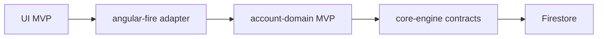
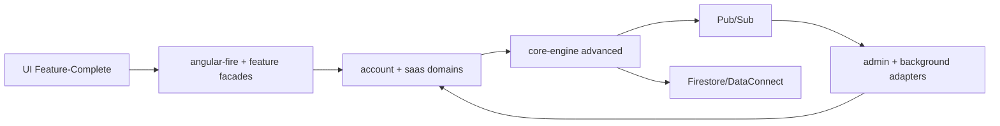

# ng-events - Architecture Plan

## Executive Summary
ng-events is an event-sourced, multi-tenant SaaS platform with causality tracking. It separates pure
domain logic (core-engine, saas-domain, account-domain) from SDK integrations (platform-adapters)
and Angular UI (ui-angular). Auth flows follow @angular/fire/auth → @delon/auth → DA_SERVICE_TOKEN
→ @delon/acl, and tenancy follows Account (User/Organization/Bot) → Workspace (blueprintId) →
Module → Entity. This document maps the skeleton to the package layout, aligns with 0.md’s causality
flow and multi-tenant templates, and outlines phased deployment from MVP to target architecture.

## System Context
```mermaid
graph TD
    subgraph Users["External Actors"]
        U1[Workspace Member]
        U2[Workspace Admin]
        U3[Automation/Integration]
    end

    subgraph NG["ng-events Boundary"]
        UI[ui-angular<br/>Angular SPA]
        PAD[platform-adapters<br/>firebase/angular-fire + auth facades]
        PAB[platform-adapters<br/>firebase/admin + services]
        AUTHCHAIN[@angular/fire/auth → @delon/auth<br/>→ DA_SERVICE_TOKEN → @delon/acl]
        DOM[saas-domain + account-domain<br/>pure TS]
        CORE[core-engine<br/>event sourcing + causality]
    end

    Auth[Identity Provider<br/>(OIDC/Firebase Auth)]
    FS[Firestore / DataConnect]
    Queue[Pub/Sub / Event Bus]
    Monitor[Monitoring & Logging]

    U1 -->|browser| UI
    U2 -->|admin console| UI
    U3 -->|webhook/api| PAB

    UI --> PAD
    PAD --> AUTHCHAIN
    AUTHCHAIN --> DOM
    PAD --> PAB
    PAB --> DOM
    DOM --> CORE
    CORE --> FS
    CORE --> Queue
    PAD --> Auth
    PAB --> Auth
    PAB --> Monitor
    Queue --> PAB
    FS --> PAD
```

### Explanation
- **Key Components:** External actors (members, admins, automations); identity provider; data plane
  (Firestore/DataConnect), event bus, monitoring; internal boundary containing UI, adapters, domains,
  and core-engine; explicit auth chain @angular/fire/auth → @delon/auth → DA_SERVICE_TOKEN →
  @delon/acl.
- **Relationships:** UI talks only through angular-fire adapters; admin/server functions use
  firebase-admin adapters; auth chain feeds ACL guards before domain commands; domains remain
  framework-agnostic and rely on core-engine abstractions for events and causality; persistence via
  Firestore/DataConnect; async fan-out through Pub/Sub.
- **Design Decisions:** Preserve strict dependency direction (UI → adapters → domain → core); isolate
  SDKs to adapters; enforce authentication through DA_SERVICE_TOKEN-style entry points and ACL.
- **NFR Considerations:** Scalability via stateless SPA and horizontally scalable cloud functions;
  performance through client-side projections and cached queries; security through least-privilege
  adapters and centralized auth/ACL; reliability via event replay and monitored queues;
  maintainability via clear boundaries and path mappings.
- **Trade-offs:** Additional indirection may add latency; mitigated with projection caches and
  localized adapters.
- **Risks/Mitigations:** SDK leakage into domain (mitigate with lint rules/reviews); auth drift
  (centralize token adapters and ACL checks); event-store consistency (idempotent writes, causality
  metadata).

## Architecture Overview
- **Pattern:** DDD + Event Sourcing + Causality Tracking (per 0.md).
- **Boundaries:** core-engine (infrastructure abstractions), account-domain/saas-domain (business
  aggregates), platform-adapters (SDK bridges), ui-angular (presentation).
- **Data Contract:** Domain events carry causality metadata (causedBy, causedByUser, causedByAction,
  blueprintId, timestamp).

## Component Architecture
```mermaid
graph LR
    UI[ui-angular\nSPA, signals, facades]
    AF[platform-adapters\nfirebase/angular-fire]
    ADM[platform-adapters\nfirebase/admin + services]
    ADP[platform-adapters\nauth/notification/analytics]
    ACL[@delon/auth + DA_SERVICE_TOKEN + @delon/acl]
    ACC[account-domain\nworkspace/membership aggregates]
    SAAS[saas-domain\nissue/task/payment aggregates]
    CORE[core-engine\naggregate base, event store, causality, projections]

    UI --> AF
    AF --> ACL
    ACL --> ADP
    AF --> ACC
    AF --> SAAS
    ADP --> ACC
    ADP --> SAAS
    ACC --> CORE
    SAAS --> CORE
    CORE -->|events| ADP
```

### Explanation
- **Components:** UI facades with Angular signals; angular-fire adapters; admin/backend adapters;
  ACL/auth chain; domain packages (account-domain, saas-domain); core-engine with event store
  abstractions and causality tracking.
- **Responsibilities:** UI renders and dispatches commands; adapters translate to domain commands and
  queries; ACL enforces identity/role; domains enforce invariants; core-engine persists events and
  builds projections.
- **Design Decisions:** Keep domain pure TS; adapters own SDK logic; commands/queries flow downward,
  events and projections flow upward; ACL centralized via DA_SERVICE_TOKEN.
- **NFR Considerations:** Scalability via thin UI and horizontally scalable adapters; performance via
  projections and cached queries; security through adapter-level auth + ACL guards; reliability
  through replayable events; maintainability through clear path mappings and package layering.
- **Trade-offs:** More packages increase coordination overhead; mitigated with shared contracts in
  core-engine.
- **Risks/Mitigations:** Inconsistent contracts (define shared types in core-engine); accidental
  cross-boundary imports (lint/CI checks).

## Package Skeletons
- **packages/**: Monorepo root enforcing flow core-engine → account-domain → saas-domain →
  platform-adapters → ui-angular. NFR: maintainability via layering; security by isolating SDK use
  to adapters.
- **packages/core-engine**: Event sourcing bases, event store interfaces, causality metadata,
  projection contracts, saga/process abstractions, rebuilders. Rules: pure TypeScript, no SDKs.
  NFR: reliability via deterministic replay; scalability via append-only stores; maintainability via
  shared contracts.
- **packages/account-domain**: Account (User/Organization/Bot), Workspace, Membership aggregates;
  commands/events; ACL/membership policies; blueprintId enforcement. Rules: depends only on
  core-engine; no SDKs. NFR: security via role/permission checks; reliability via Owner protections
  and composite keys; maintainability via templates.
- **packages/saas-domain**: Business aggregates (task/issue/payment/etc.), module gating
  (enabledModules), tenant-aware commands/events with blueprintId; projections for feature domains.
  Rules: depends on core-engine; no SDKs. NFR: scalability via per-tenant sharding; performance via
  projections; security via workspace membership propagation.
- **packages/platform-adapters**: firebase/admin (backend), angular-fire (frontend),
  auth/notification/analytics adapters, DA_SERVICE_TOKEN provider, ACL integration, projection
  pipelines, rebuild/job runners. Rules: SDKs only here; admin uses firebase-admin; client uses
  @angular/fire; no domain logic. NFR: security via least-privilege service accounts; reliability via
  retries/backoff; performance via batched writes and cached queries.
- **packages/ui-angular**: Angular SPA (standalone components), feature routes, signals-based stores,
  facades to adapters, ACL guards, DA_SERVICE_TOKEN composition. Rules: uses platform-adapters
  (client side only); no direct domain/core imports; no firebase-admin. NFR: performance via signals
  and projection reads; security via route guards/ACL; maintainability via feature isolation and
  facades.

## Contracts & Metadata (Commands / Events / Causality)
- **Commands:** dtoName = `Verb + Aggregate` (e.g., InviteMemberCommand) carrying accountId,
  workspaceId/blueprintId, causedByAction, actor claims, and idempotency key.
- **Events:** eventName = `AggregateVerbPastTense` with aggregateId, blueprintId, version,
  causality metadata (causedBy event/command id, causedByUser, causedByAction, timestamp).
- **Metadata Schema:** `{ causedBy, causedByUser, causedByAction, blueprintId, timestamp, version,
  idempotencyKey }`; stored in core-engine contracts; adapters must populate; domains validate
  blueprintId and causality presence.
- **Adapter Facades:** All UI/backend entry points go through DA_SERVICE_TOKEN; facades translate
  UI DTOs to domain commands, enrich with auth claims and blueprintId, and call domain/application
  services—no direct domain access from UI.
- **Validation:** Domain rejects commands missing blueprintId or causality chain; projections enforce
  blueprintId on writes; rebuilders preserve metadata during replay.

## Projection Catalog & Operations
- **Per Domain:** Account-domain (Workspace/Membership projections), saas-domain (Task/Issue/Payment
  projections), security/ACL projections for @delon/acl guards.
- **Rebuild Strategy:** Full (schema change), Incremental (from timestamp), Selective (aggregateIds)
  per ProjectionRebuilder. Schedule jobs per domain via Cloud Run (no Cloud Functions), with onError
  skip for ops and abort for tests.
- **Observability:** Track projection lag, lastEventId, errors; emit metrics per blueprintId.
- **Ops Playbook:** Nightly incremental rebuild, weekly selective for hot tenants, ad-hoc full after
  schema migrations.

## Folder/File Trees (Skeleton with key files)
```text
packages/
  core-engine/
    src/
      events/
        domain-event.ts            # base event + causality metadata schema
        event-store.interface.ts   # append/load contract
      projections/
        projection.interface.ts    # read model contract
        projection-rebuilder.ts    # full/incremental/selective APIs
      causality/
        causality-metadata.ts      # causedBy, blueprintId, timestamp, version
      saga/
        process-manager.ts
      rebuild/
        rebuild-runner.ts          # used by adapters jobs
    index.ts
  account-domain/
    src/
      aggregates/
        account.aggregate.ts       # User/Organization/Bot
        workspace.aggregate.ts     # blueprintId boundary
        membership.aggregate.ts    # owner protection, roles
      commands/
        invite-member.command.ts
        change-role.command.ts
      events/
        membership-created.event.ts
        role-changed.event.ts
      projections/
        membership.projection.ts
        workspace.projection.ts
      policies/
        acl.policy.ts
    index.ts
  saas-domain/
    src/
      aggregates/
        task.aggregate.ts
        issue.aggregate.ts
      commands/
        create-task.command.ts
        complete-task.command.ts
      events/
        task-created.event.ts
        task-completed.event.ts
      projections/
        task.projection.ts
      modules/
        enabled-modules.ts         # module gating
    index.ts
  platform-adapters/
    firebase/
      admin/
        event-store/
          firestore-event-store.ts
        projection-writer/
          firestore-writer.ts
        auth/
          service-account-auth.ts
        jobs/
          projection-rebuild.job.ts  # Cloud Run scheduler entry
      angular-fire/
        auth/
          client-auth.service.ts
        facades/
          membership.facade.ts      # DA_SERVICE_TOKEN entry
          task.facade.ts
        queries/
          membership.query.ts
    auth/
      da-service-token.provider.ts  # single UI entry point
    notification/
      notification.adapter.ts
    analytics/
      analytics.adapter.ts
    index.ts
  ui-angular/
    src/app/
      core/
        providers/app.config.ts    # wires DA_SERVICE_TOKEN
        acl/acl.guard.ts
      adapters/                    # facades calling platform-adapters
        membership.facade.ts
        task.facade.ts
      features/
        workspace/
        tasks/
      shared/
        components/
        services/
```

## Deployment Architecture
```mermaid
graph LR
    subgraph Client
        Browser[Browser\nAngular SPA]
    end
    subgraph Edge
        CDN[CDN / Hosting]
    end
    subgraph Cloud["Cloud (prod/stage/dev)"]
    CF[Cloud Run/Functions\nfirebase-admin adapters]
    AFWS[Angular-Fire Services\n(auth, firestore, storage)]
        FS[Firestore / DataConnect]
        PUB[Pub/Sub / Event Bus]
        MON[Monitoring/Logging/Tracing]
    end

    Browser --> CDN --> AFWS
    Browser --> AFWS
    AFWS --> FS
    AFWS --> CF
    CF --> FS
    CF --> PUB
    PUB --> CF
    AFWS --> MON
    CF --> MON
```

### Explanation
- **Environments:** Dev/stage/prod with parity; SPA served via CDN/Hosting; backend services on
  Cloud Run (no Cloud Functions in this project).
- **Network Zones:** Client/edge, public service plane, managed data plane; privileged admin adapters
  isolated in CF with service accounts.
- **Deployment Strategy:** CI/CD builds SPA artifacts and deploys to hosting; functions run adapters
  for admin/event processing; infrastructure as code for env parity. Use Cloud Run for admin/event
  pipelines to avoid functions footprint.
- **NFR Considerations:** Scalability via auto-scaling CF and CDN caching; performance via edge
  delivery and localized reads; security via service accounts, IAM, and restricted egress; reliability
  through managed Firestore/PubSub SLAs; maintainability via IaC and blue/green rollouts.
- **Trade-offs:** Cloud-function cold starts; mitigated with min-instances/warmers.
- **Risks/Mitigations:** Misconfigured IAM (reviewed least privilege); env drift (IaC + drift
  detection).

## Data Flow
```mermaid
flowchart TD
    subgraph Identity["Identity Layer"]
        A[Account<br/>User | Organization | Bot]
        I1[@angular/fire/auth]
        I2[@delon/auth]
        I3[DA_SERVICE_TOKEN]
        I4[@delon/acl]
    end
    subgraph WorkspaceLayer["Workspace Layer"]
        B[Workspace<br/>blueprintId boundary]
        M[AccountWorkspaceMembership<br/>role-based access]
    end
    subgraph Domain["Domain Layer"]
        C[Module]
        D[Entity]
    end
    subgraph EventLayer["Event Layer"]
        E1[Event 1]
        E2[Event 2]
        E3[Event 3]
    end
    subgraph Processing["Processing Layer"]
        F[Event Sourcing]
        G[Causality Tracking]
    end

    A --> I1 --> I2 --> I3 --> I4 --> B
    A --> M
    B --> M
    B --> C
    C --> D
    D --> E1
    E1 --> E2
    E2 --> E3
    E3 --> F
    F --> G

    E1 -.-> F
    E2 -.-> F
    E3 -.-> F
    E1 -.-> G
    E2 -.-> G
    E3 -.-> G

    E1 ==> E2
    E2 ==> E3
```

### Explanation
- **Key Flow:** Identity/auth chain (@angular/fire/auth → @delon/auth → DA_SERVICE_TOKEN →
  @delon/acl) establishes roles for Accounts (User/Organization/Bot); membership and blueprintId
  define multi-tenant boundary; workspace → module/entity → ordered events; events persist via
  core-engine event store; projections consume events with causality links for traceability.
- **Design Decisions:** Preserve event ordering per aggregate; attach causality metadata; enforce
  access via ACL + membership + blueprintId; enable replay to rebuild projections.
- **NFR Considerations:** Scalability via append-only writes and parallel projection handlers;
  performance via idempotent projections and batching; security via blueprintId isolation and ACL;
  reliability via deterministic replay; maintainability via declarative projection builders.
- **Trade-offs:** Event growth; mitigated with snapshotting and archival.
- **Risks/Mitigations:** Causality gaps (validate causedBy chain); projection drift (scheduled
  rebuilds).

## Key Workflows
```mermaid
sequenceDiagram
    participant User as Member/Admin
    participant UI as ui-angular
    participant AF as angular-fire adapter
    participant Auth as @delon/auth + DA_SERVICE_TOKEN + @delon/acl
    participant DOM as domain (account/saas)
    participant CORE as core-engine
    participant FS as Firestore/Event Store
    participant PROJ as Projection Builder

    User->>UI: Intent (e.g., invite member)
    UI->>AF: Command DTO (validated + client auth)
    AF->>Auth: Exchange token → ACL check
    Auth->>DOM: Domain command (pure TS with blueprintId + role)
    DOM->>CORE: Append domain events (with causality)
    CORE->>FS: Persist events
    CORE-->>PROJ: Notify projection pipeline
    PROJ->>FS: Upsert read models
    UI<<--AF: Query projections (signals/async)
    User<<--UI: Updated workspace view
```

### Explanation
- **Overview:** End-to-end command path from UI to projections.
- **Design Decisions:** UI never calls domain directly; adapters enforce auth; domain emits events;
  projections supply fast reads.
- **NFR Considerations:** Scalability via async projection fan-out; performance via read-model cache;
  security via adapter guardrails; reliability via idempotent projection writes; maintainability via
  DTO-to-command mapping.
- **Trade-offs:** Slight write latency; mitigated with optimistic UI updates.
- **Risks/Mitigations:** Projection lag (emit progress metrics); auth bypass risk (single entry token
  pattern).

## Additional Diagrams (Causality & Projections)
```mermaid
graph LR
    Cmd[Command]
    Ev1[Event n]
    Ev2[Event n+1]
    Ev3[Event n+2]
    Meta[Metadata\n(causedBy, blueprintId, timestamp)]
    Snap[Snapshot/Projection]

    Cmd --> Ev1
    Ev1 -->|causedBy=Cmd| Ev2
    Ev2 -->|causedBy=Ev1| Ev3
    Ev1 --> Meta
    Ev2 --> Meta
    Ev3 --> Meta
    Ev1 --> Snap
    Ev2 --> Snap
    Ev3 --> Snap
```

### Explanation
- **Purpose:** Highlight causality links and projection updates.
- **Design Decisions:** Every event carries causality chain; projections are idempotent and
  rebuildable.
- **NFR Considerations:** Observability via metadata; reliability via replay; maintainability via
  structured metadata schema.
- **Risks/Mitigations:** Missing metadata (schema validation); replay cost (batch rebuilders).

## Multi-Tenant Model (Account → Workspace → Module → Entity)
```mermaid
flowchart LR
    AC[Account<br/>User | Organization | Bot]
    WS[Workspace<br/>blueprintId boundary]
    MEM[AccountWorkspaceMembership<br/>role + permissions]
    MOD[Module<br/>enabledModules]
    ENT[Entity/Aggregate<br/>(Task/Issue/Payment...)]

    AC --> MEM
    WS --> MEM
    MEM --> MOD
    MOD --> ENT
```

### Explanation
- **Overview:** Account (User/Organization/Bot) is the business actor; Workspace is the multi-tenant
  container keyed by blueprintId; membership binds Account to Workspace with roles/permissions;
  enabled modules gate access to aggregates/entities.
- **Design Decisions:** Single-direction dependency chain (Account → Workspace → Module → Entity);
  blueprintId carried through commands/events; membership and ACL enforce access.
- **NFR Considerations:** Scalability via tenant-isolated data and sharded blueprintId; performance
  via module gating and cached projections; security via role-based membership + ACL; reliability via
  deterministic event sourcing per tenant; maintainability via strict chain and shared templates.
- **Risks/Mitigations:** Cross-tenant leakage (validate blueprintId in commands/events); stale
  membership (projection rebuild and cache invalidation); module toggles drift (event-driven
  updates).

## Phased Development

### Phase 1: Initial Implementation (MVP)
- UI uses minimal facades for workspace and membership flows.
- Adapters provide basic auth and Firestore persistence.
- Domains cover critical aggregates (Account, Workspace, Membership) with event sourcing hooks.
- Core-engine supplies event store contracts and causality metadata only (no advanced rebuilders).



### Phase 2+: Target Architecture
- Full saas-domain feature set (tasks, issues, payments) with composite Membership rules.
- Platform-adapters add notifications, analytics, admin pipelines, and rebuilders.
- Core-engine adds projection rebuild, saga/process managers, and causality analytics.
- UI adopts signals-first stores and feature-driven routes.



### Migration Path
- **Expand domains:** Add aggregates in saas-domain after account-domain is stable.
- **Enhance adapters:** Introduce analytics/notification adapters without touching domains.
- **Enable rebuilders:** Roll out projection rebuild and saga support in core-engine, then wire
  adapters.
- **UI evolution:** Replace direct queries with store/signals; add optimistic UI and loading/error
  states.

## Non-Functional Requirements Analysis

### Scalability
- Horizontal scaling of adapters and Cloud Functions; CDN-backed SPA; sharded event streams per
  blueprintId; replay-friendly projections.

### Performance
- Cached read models; batching in projection writers; minimized cross-boundary chatter via facades;
  edge delivery for assets.

### Security
- Auth enforced in adapters; domain isolation by blueprintId; service accounts for admin workloads;
  least-privilege IAM; no SDK leakage into domains.

### Reliability
- Event sourcing with idempotent handlers; projection rebuild tooling; monitoring/alerts on lag and
  failure; retries with backoff on async pipelines.

### Maintainability
- Strict layering and path mappings; framework-agnostic domains; shared contracts in core-engine;
- documentation per package; CI guards for imports.

## Risks and Mitigations
- **SDK leakage into domains:** Enforce import rules and reviews.
- **Projection drift:** Scheduled rebuilds and reconciliation scripts.
- **Auth gaps:** Single entry token pattern and adapter-level guards.
- **Cost/latency from fan-out:** Use batch writes and snapshotting.
- **Cold starts:** Configure min-instances for critical functions.

## Technology Stack Recommendations
- **UI:** Angular standalone components with signals; AngularFire for client SDKs.
- **Adapters:** firebase-admin for backend, @angular/fire for client, Pub/Sub for async, optional
  DataConnect for typed reads.
- **Core:** TypeScript event sourcing library (core-engine) with causality metadata; projection
  rebuilders.
- **Ops:** Cloud Run/Functions, Firestore, Pub/Sub, Cloud Monitoring; IaC via Terraform or Firebase
  configs.

## Next Steps
- Confirm package-level contracts for commands/events and causality metadata schema.
- Align adapter facades with DA_SERVICE_TOKEN entry point.
- Define projection catalogs per domain and schedule rebuild jobs.
- Add CI checks for boundary imports and metadata completeness.
