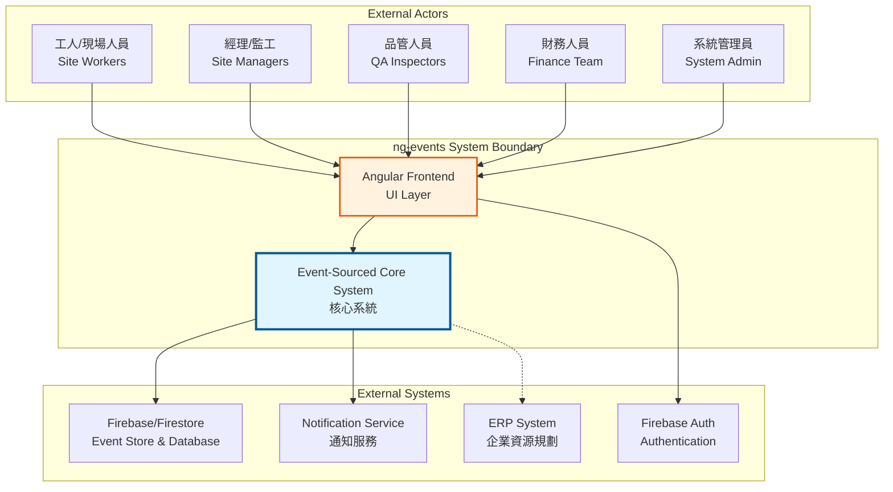
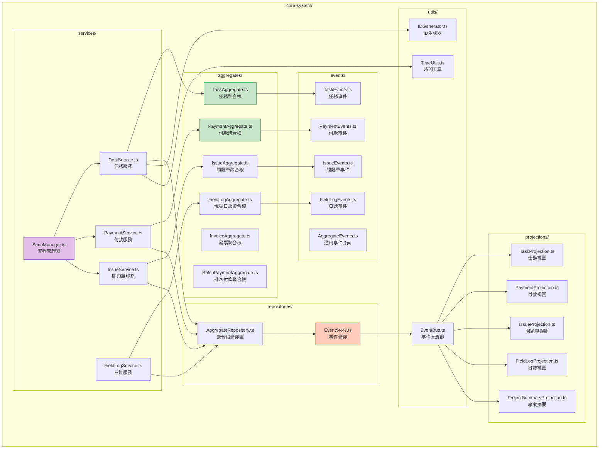
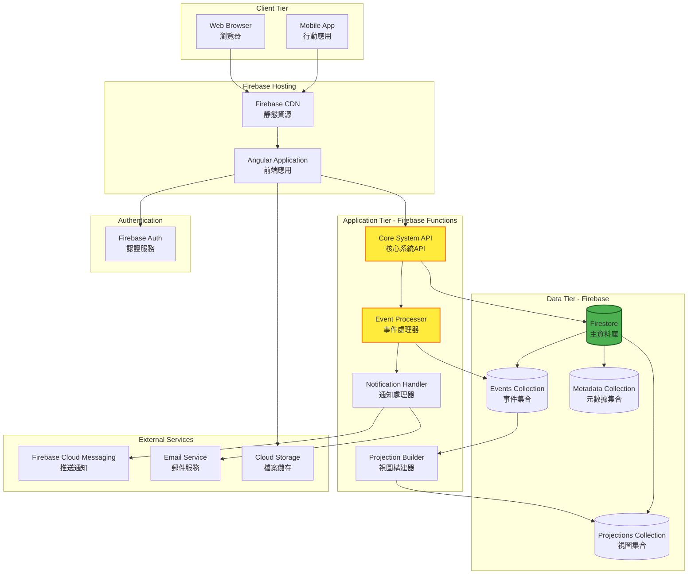
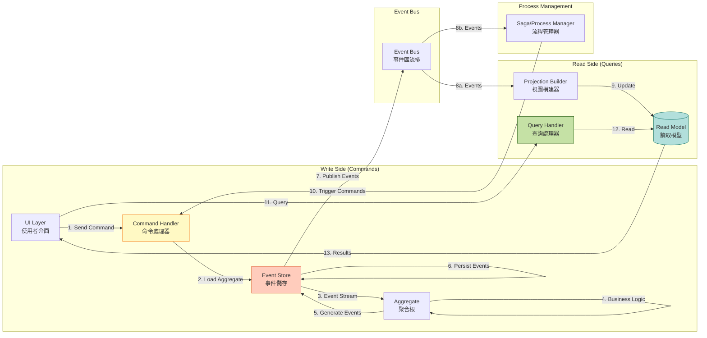
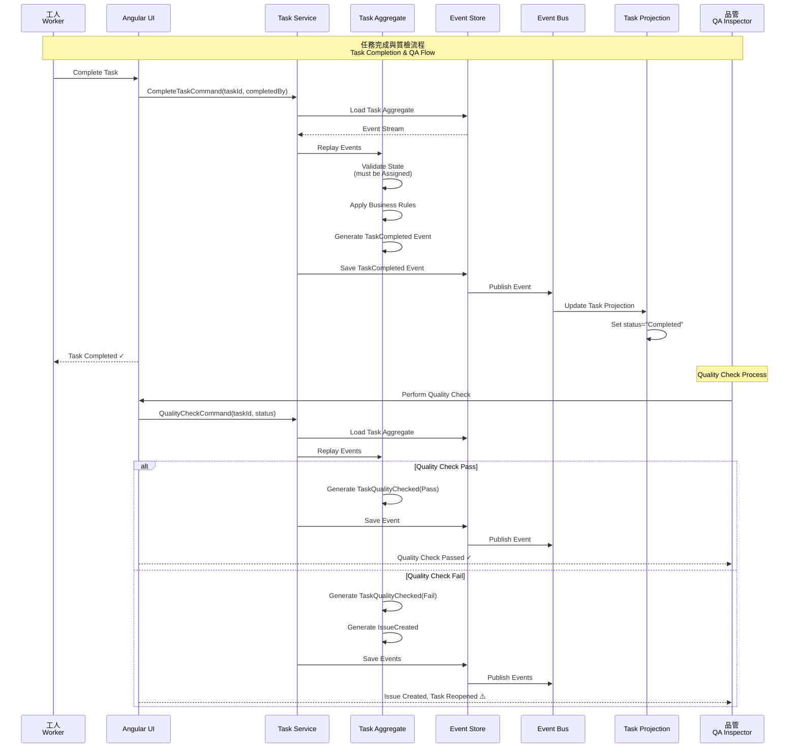
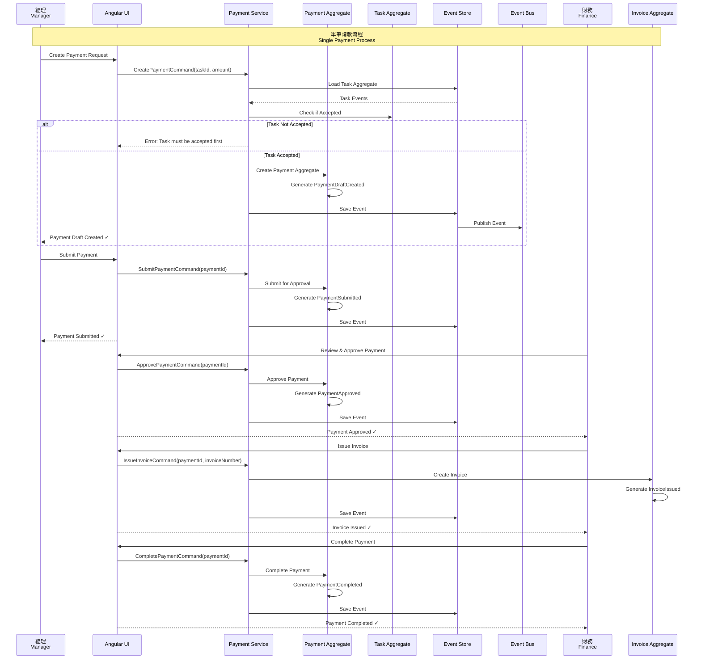
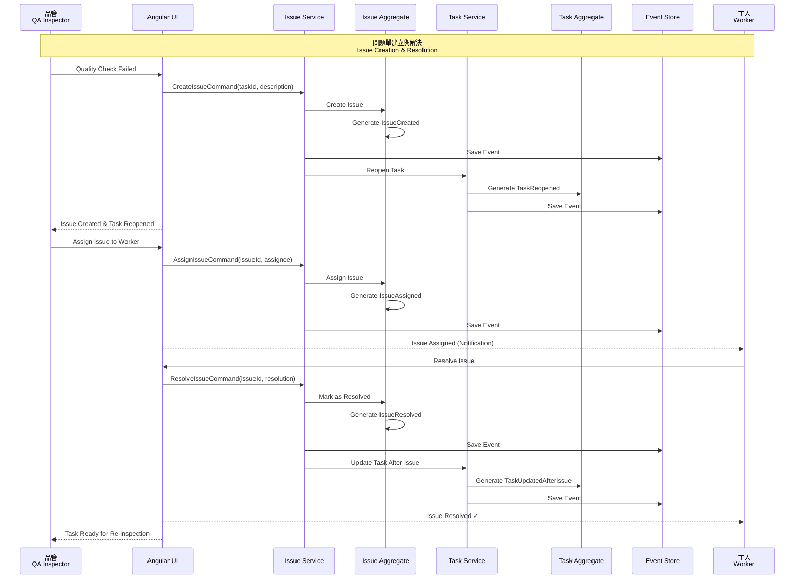
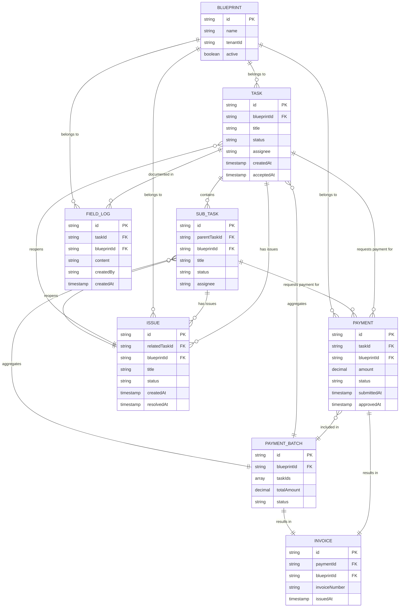
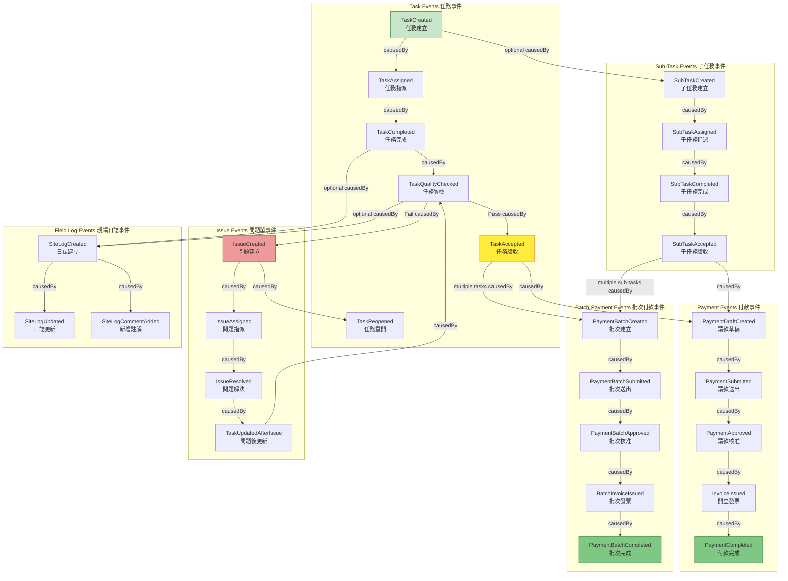

# ng-events - Event-Sourced Core System Architecture

## Executive Summary

This document outlines the architecture for an Event-Sourced, Causality-Driven core system for the ng-events project. The system is designed to manage construction site operations including Tasks, Payments, Issues, and Field Logs with complete auditability and causality tracking.

The architecture separates the event-sourced core system from the Angular frontend application to prevent development blocking and maintain clear boundaries between domain logic and presentation layers. The system follows Domain-Driven Design (DDD) principles with Event Sourcing and CQRS patterns.

**Key Architectural Principles:**
- **Event Sourcing**: All state changes are captured as immutable events
- **Causality-Driven**: Every event tracks its cause through `causedByEventId`
- **CQRS**: Separate write (command) and read (query) models
- **Multi-Tenancy**: Blueprint-based data isolation
- **Immutability**: Events are immutable facts, never modified
- **Replay**: System state can be reconstructed by replaying events

---

## System Context

### System Context Diagram



### System Context Explanation

**Overview:**
The ng-events system provides a construction project management platform with event-sourced backend and Angular frontend. The system boundary separates the core event processing logic from the user interface, enabling independent evolution and scaling.

**Key External Actors:**
1. **Site Workers (工人/現場人員)**: Create and update field logs, complete tasks
2. **Site Managers (經理/監工)**: Assign tasks, approve payments, manage workflows
3. **QA Inspectors (品管人員)**: Perform quality checks, create issues
4. **Finance Team (財務人員)**: Process payments, issue invoices
5. **System Admin (系統管理員)**: Configure system, manage users and blueprints

**System Components:**
- **Angular Frontend**: User interface built with ng-alain framework, handles presentation and user interaction
- **Event-Sourced Core System**: Business logic layer implementing event sourcing, CQRS, and causality tracking

**External Systems:**
- **Firebase/Firestore**: Primary data store for events and projections
- **Firebase Auth**: User authentication and authorization
- **Notification Service**: Push notifications and email alerts
- **ERP System**: Optional integration for financial data synchronization

**Relationships:**
- All user interactions flow through the Angular frontend
- Frontend communicates with core system via well-defined API boundaries
- Core system stores all events in Firebase with causality metadata
- External integrations are handled asynchronously to maintain system responsiveness

---

## Architecture Overview

The ng-events architecture follows a **Causality-Driven Event-Sourced** approach with clear separation of concerns:

### Architectural Layers

```
┌─────────────────────────────────────────────────────────────┐
│                    Angular Frontend (src/)                   │
│  ┌──────────────┐  ┌──────────────┐  ┌──────────────┐      │
│  │  Components  │  │   Services   │  │    Guards    │      │
│  └──────────────┘  └──────────────┘  └──────────────┘      │
└─────────────────────────────────────────────────────────────┘
                            │
                            ▼
┌─────────────────────────────────────────────────────────────┐
│              Event-Sourced Core System (core-system/)        │
│                                                               │
│  ┌─────────────────────────────────────────────────────┐    │
│  │  L0: Fact & Causality Layer (不可污染)               │    │
│  │  • Domain Events (Immutable)                        │    │
│  │  • Event Metadata (causedByEventId, blueprintId)   │    │
│  │  • Deterministic Rules                              │    │
│  └─────────────────────────────────────────────────────┘    │
│                            │                                 │
│                            ▼                                 │
│  ┌─────────────────────────────────────────────────────┐    │
│  │  L1: Process & Policy Layer (因果運算)               │    │
│  │  • Saga / Process Manager                           │    │
│  │  • State Machine                                    │    │
│  │  • Business Rules & Validation                      │    │
│  └─────────────────────────────────────────────────────┘    │
│                            │                                 │
│                            ▼                                 │
│  ┌─────────────────────────────────────────────────────┐    │
│  │  L2: Projection & Decision Layer (查詢與決策)         │    │
│  │  • Read Models / Projections                        │    │
│  │  • Query Handlers                                   │    │
│  │  • Reporting & Analytics                            │    │
│  └─────────────────────────────────────────────────────┘    │
└─────────────────────────────────────────────────────────────┘
                            │
                            ▼
┌─────────────────────────────────────────────────────────────┐
│                  Firebase/Firestore Storage                  │
│  ┌──────────────┐  ┌──────────────┐  ┌──────────────┐      │
│  │ Event Store  │  │  Projections │  │   Metadata   │      │
│  └──────────────┘  └──────────────┘  └──────────────┘      │
└─────────────────────────────────────────────────────────────┘
```

### Key Architectural Patterns

1. **Event Sourcing**: System state derived from event history
2. **CQRS (Command Query Responsibility Segregation)**: Separate write and read models
3. **Causality Tracking**: Every event references its causing event
4. **Aggregate Pattern**: Consistency boundaries around domain entities
5. **Repository Pattern**: Abstract event storage and retrieval
6. **Projection Pattern**: Build read models from event streams
7. **Saga Pattern**: Coordinate long-running business processes

### Design Decisions

**Decision 1: Separate core-system/ from src/**
- **Rationale**: Prevents frontend and backend development from blocking each other
- **Benefit**: Clear separation of concerns, independent testing and deployment
- **Trade-off**: Requires clear API contracts and integration testing

**Decision 2: Firebase/Firestore as Event Store**
- **Rationale**: Existing infrastructure, good query capabilities, real-time updates
- **Benefit**: Reduced operational complexity, built-in scalability
- **Trade-off**: Vendor lock-in, need to design around Firestore limitations

**Decision 3: TypeScript for Core System**
- **Rationale**: Type safety, consistency with Angular frontend
- **Benefit**: Shared types, easier refactoring, better IDE support
- **Trade-off**: Runtime overhead compared to compiled languages

**Decision 4: Blueprint-based Multi-Tenancy**
- **Rationale**: Strong data isolation, clear tenant boundaries
- **Benefit**: Enhanced security, simplified queries
- **Trade-off**: Requires consistent blueprintId filtering across all operations

---

## Component Architecture

### Component Diagram



### Component Architecture Explanation

**Overview:**
The component architecture follows Domain-Driven Design principles with clear separation between aggregates, events, services, and projections. Each component has a single responsibility and well-defined boundaries.

**Core Components:**

#### 1. Aggregates (aggregates/)
Aggregates are the consistency boundaries in the domain model. Each aggregate:
- Encapsulates business rules and invariants
- Produces domain events for state changes
- Can be reconstructed by replaying events
- Maintains its own lifecycle

**Key Aggregates:**
- **TaskAggregate**: Manages task lifecycle (create, assign, complete, quality check, accept)
- **PaymentAggregate**: Handles individual payment requests
- **InvoiceAggregate**: Manages invoice generation and tracking
- **IssueAggregate**: Tracks quality issues and resolutions
- **FieldLogAggregate**: Records on-site activities and observations
- **BatchPaymentAggregate**: Coordinates multiple payments

#### 2. Events (events/)
Events represent immutable facts that have occurred in the system:
- Capture all state changes as events
- Include causality metadata (`causedByEventId`, `blueprintId`)
- Versioned for schema evolution
- Used for audit trail and replay

**Event Categories:**
- **TaskEvents**: TaskCreated, TaskAssigned, TaskCompleted, TaskQualityChecked, TaskAccepted
- **PaymentEvents**: PaymentDraftCreated, PaymentSubmitted, PaymentApproved, PaymentCompleted
- **IssueEvents**: IssueCreated, IssueAssigned, IssueResolved, TaskReopened
- **FieldLogEvents**: SiteLogCreated, SiteLogUpdated, SiteLogCommentAdded

#### 3. Repositories (repositories/)
Abstract data access and event persistence:
- **EventStore**: Persists events to Firestore with causality tracking
- **AggregateRepository**: Loads aggregates by replaying events, saves new events

**Responsibilities:**
- Event persistence and retrieval
- Causality chain validation
- Blueprint-based filtering
- Optimistic concurrency control

#### 4. Services (services/)
Coordinate business operations and orchestrate aggregates:
- **TaskService**: Task creation, assignment, completion workflows
- **PaymentService**: Payment request processing
- **IssueService**: Issue tracking and resolution
- **FieldLogService**: Field log management
- **SagaManager**: Long-running process coordination

**Design Principle:** Services are thin coordinators, business logic lives in aggregates.

#### 5. Projections (projections/)
Build read models from event streams for efficient querying:
- **TaskProjection**: Current task status and details
- **PaymentProjection**: Payment tracking and history
- **IssueProjection**: Open and resolved issues
- **FieldLogProjection**: Field log timeline
- **ProjectSummaryProjection**: Aggregated project statistics

**Purpose:** Separate read and write models (CQRS), optimize for different query patterns.

#### 6. Utils (utils/)
Shared utilities and infrastructure:
- **EventBus**: Pub/sub mechanism for event distribution
- **IDGenerator**: Consistent ID generation with causality support
- **TimeUtils**: Timestamp handling and time-based operations

**Component Relationships:**
1. Services create/load Aggregates via Repository
2. Aggregates produce Events
3. Repository persists Events to EventStore
4. EventStore publishes Events to EventBus
5. Projections subscribe to EventBus and update read models
6. SagaManager coordinates cross-aggregate processes

**Design Benefits:**
- **Testability**: Each component can be tested in isolation
- **Maintainability**: Clear responsibilities and dependencies
- **Scalability**: Projections can scale independently
- **Flexibility**: Easy to add new aggregates or projections

---

## Deployment Architecture

### Deployment Diagram



### Deployment Architecture Explanation

**Overview:**
The deployment leverages Firebase's serverless infrastructure to provide a scalable, managed platform with minimal operational overhead. The architecture separates static content delivery, API processing, and data persistence across appropriate Firebase services.

**Deployment Tiers:**

#### 1. Client Tier
- **Web Browser**: Desktop access via modern browsers (Chrome, Firefox, Safari, Edge)
- **Mobile App**: Progressive Web App (PWA) or native mobile access
- **Distribution**: Global CDN for low-latency access

#### 2. Hosting & CDN (Firebase Hosting)
- **Firebase CDN**: Serves static assets (HTML, CSS, JS, images)
- **Angular Application**: Pre-built and optimized production bundle
- **Benefits**: 
  - Global edge caching
  - Automatic HTTPS
  - Instant cache invalidation
  - Version rollback capability

#### 3. Application Tier (Firebase Functions)
Serverless functions handling core business logic:

- **Core System API**: RESTful API endpoints for commands and queries
  - Command handlers (create task, submit payment, etc.)
  - Query handlers (get task, list payments, etc.)
  - Input validation and authorization
  
- **Event Processor**: Asynchronous event processing
  - Event persistence to Firestore
  - Causality validation
  - Event publishing to EventBus
  
- **Projection Builder**: Updates read models from events
  - Subscribes to event streams
  - Maintains denormalized views
  - Handles projection rebuilding
  
- **Notification Handler**: Manages user notifications
  - Push notifications via FCM
  - Email notifications
  - In-app notification updates

**Function Configuration:**
- Runtime: Node.js 20+
- Memory: 512MB-1GB per function
- Timeout: 60s for API, 540s for background processing
- Concurrency: Auto-scaling based on load

#### 4. Data Tier (Firebase/Firestore)
NoSQL document database with three main collections:

- **Events Collection**: Immutable event log
  - Partitioned by blueprintId for multi-tenancy
  - Indexed by aggregateId, timestamp, causedByEventId
  - Append-only, never updated or deleted
  - Retention: Unlimited (archive old data if needed)

- **Projections Collection**: Denormalized read models
  - Optimized for query patterns
  - Updated by Projection Builder
  - Blueprint-isolated
  - Can be rebuilt from events

- **Metadata Collection**: System configuration
  - Blueprint definitions
  - User preferences
  - System settings
  - Audit logs

#### 5. Authentication (Firebase Auth)
- User authentication (Email/Password, Google, SSO)
- Token-based authorization
- Role-based access control (RBAC)
- Custom claims for blueprint access

#### 6. External Services
- **Firebase Cloud Messaging**: Push notifications to mobile/web
- **Email Service**: Sendgrid or Firebase Extensions for email
- **Cloud Storage**: File attachments, photos, documents

**Deployment Environments:**

#### Development
- **URL**: https://dev-ng-events.web.app
- **Database**: dev-ng-events Firestore
- **Purpose**: Feature development and testing
- **Data**: Synthetic test data

#### Staging
- **URL**: https://staging-ng-events.web.app
- **Database**: staging-ng-events Firestore
- **Purpose**: Pre-production validation
- **Data**: Production-like data (sanitized)

#### Production
- **URL**: https://ng-events.web.app
- **Database**: prod-ng-events Firestore
- **Purpose**: Live system
- **Data**: Real customer data
- **SLA**: 99.9% uptime target

**Deployment Strategy:**
1. **Continuous Integration**: GitHub Actions on every push
2. **Automated Testing**: Unit, integration, and E2E tests
3. **Preview Deploys**: Automatic preview for pull requests
4. **Staging Deploy**: Auto-deploy to staging on merge to develop
5. **Production Deploy**: Manual approval after staging validation
6. **Rollback**: Instant rollback to previous version if issues detected

**Infrastructure Choices:**

**Why Firebase?**
- **Rapid Development**: Managed infrastructure reduces ops burden
- **Scalability**: Auto-scales from zero to millions of requests
- **Cost-Effective**: Pay-per-use pricing for startups
- **Real-time**: Built-in real-time data sync
- **Security**: Built-in auth and security rules

**Trade-offs:**
- **Vendor Lock-in**: Heavily dependent on Firebase ecosystem
- **Cost at Scale**: Can become expensive at very high volumes
- **Limited Control**: Less flexibility than self-hosted infrastructure
- **Firestore Limitations**: Query limitations compared to SQL databases

**Mitigation Strategies:**
- Use abstraction layers for data access (Repository pattern)
- Monitor costs and optimize queries
- Consider multi-cloud strategy for critical components
- Design for eventual portability (avoid deep Firebase dependencies)

---

## Data Flow

### Data Flow Diagram



### Data Flow Explanation

**Overview:**
The data flow follows CQRS (Command Query Responsibility Segregation) pattern, separating write operations (commands) from read operations (queries). This enables independent scaling and optimization of each path.

**Write Path (Command Side):**

1. **Command Initiation**: User triggers an action in the UI (e.g., "Complete Task")
2. **Command Handler**: Receives command, validates input, checks permissions
3. **Load Aggregate**: Repository loads aggregate by replaying events from Event Store
4. **Execute Business Logic**: Aggregate validates business rules and determines which events to generate
5. **Generate Events**: Aggregate produces one or more domain events (e.g., TaskCompleted)
6. **Persist Events**: Event Store saves events with causality metadata
7. **Publish Events**: Events are published to Event Bus for downstream processing

**Read Path (Query Side):**

8a. **Update Projections**: Projection Builder receives events and updates read models
9. **Maintain Read Models**: Denormalized views optimized for specific queries
11. **Query Request**: UI requests data (e.g., "Show task list")
12. **Query Handler**: Reads from appropriate projection/read model
13. **Return Results**: Formatted data returned to UI

**Process Management:**

8b. **Saga/Process Manager**: Receives events and coordinates multi-step processes
10. **Trigger Compensating Actions**: Issues new commands based on business rules

**Data Transformation Points:**

#### 1. Command Validation
- **Input**: User command with parameters
- **Validation**: Schema validation, authorization, business rule checks
- **Output**: Validated command DTO
- **Error Handling**: Validation errors returned immediately to user

#### 2. Event Generation
- **Input**: Command and current aggregate state
- **Processing**: Apply business rules, check invariants
- **Output**: One or more domain events with causality metadata
- **Guarantee**: Events are atomic and consistent within aggregate boundary

#### 3. Event Persistence
- **Input**: Domain events with metadata
- **Processing**: 
  - Validate causality chain
  - Check blueprint authorization
  - Assign event IDs
  - Add timestamps
- **Output**: Persisted immutable events
- **Guarantee**: Exactly-once event persistence with optimistic concurrency

#### 4. Projection Updates
- **Input**: Event stream from Event Bus
- **Processing**: 
  - Apply event to read model
  - Handle idempotency (skip already-processed events)
  - Update indexes and denormalized data
- **Output**: Updated read model
- **Guarantee**: Eventually consistent projections

**Data Consistency:**

#### Strong Consistency
- Within a single aggregate boundary
- All business rules enforced before event generation
- Optimistic concurrency control prevents conflicts

#### Eventual Consistency
- Between aggregates
- Between write model and read models
- Saga coordination across aggregates

**Error Handling Strategy:**

1. **Validation Errors**: Return immediately to user
2. **Business Rule Violations**: Prevent event generation, return error
3. **Infrastructure Errors**: Retry with exponential backoff
4. **Idempotency**: Ensure duplicate commands don't create duplicate events
5. **Compensation**: Use saga pattern for complex error recovery

**Data Flow Benefits:**

1. **Scalability**: Read and write sides scale independently
2. **Performance**: Optimized projections for different query patterns
3. **Auditability**: Complete event history provides full audit trail
4. **Flexibility**: Easy to add new projections without changing write side
5. **Resilience**: Event-driven architecture enables fault tolerance

**Trade-offs:**

1. **Complexity**: More moving parts than simple CRUD
2. **Eventual Consistency**: Read models may lag behind writes
3. **Storage**: Event store grows continuously (mitigation: archival strategy)
4. **Learning Curve**: Team needs to understand event sourcing concepts

---

## Key Workflows

### 1. Task Lifecycle Sequence Diagram



### 2. Payment Process Sequence Diagram



### 3. Issue Resolution Sequence Diagram



### Workflow Explanation

**Task Lifecycle Workflow:**
1. Worker completes task, triggering TaskCompleted event
2. QA inspector performs quality check
3. On pass: TaskQualityChecked(Pass) → ready for acceptance
4. On fail: TaskQualityChecked(Fail) + IssueCreated → task reopened
5. After acceptance: TaskAccepted → eligible for payment

**Key Points:**
- All state changes captured as events
- Business rules enforced in aggregate before event generation
- Causality tracked via causedByEventId
- UI updated via projections listening to events

**Payment Process Workflow:**
1. Manager creates payment draft (must have accepted task)
2. Payment submitted for approval
3. Finance reviews and approves
4. Invoice issued with invoice number
5. Payment marked as completed

**Key Points:**
- Payment linked to accepted task
- Multi-step approval process
- Invoice generation separate concern
- Each step produces distinct event

**Issue Resolution Workflow:**
1. Quality check fails → IssueCreated + TaskReopened
2. Issue assigned to worker for resolution
3. Worker resolves issue → IssueResolved
4. Task updated and ready for re-inspection

**Key Points:**
- Issues don't modify task events, create separate event stream
- Task can be reopened to previous state
- Clear audit trail of problem and resolution
- Causality chain shows issue triggered by quality check

---

## Entity Relationship Diagram



### Entity Relationship Explanation

**Core Entities:**

#### 1. TASK (任務)
Primary work unit in the system:
- Can have multiple sub-tasks
- Generates payment requests when accepted
- May have quality issues
- Documented via field logs
- Always belongs to a blueprint (tenant boundary)

#### 2. SUB_TASK (子任務)
Child tasks under a parent task:
- Linked to parent via parentTaskId
- Independent lifecycle and events
- Can have own payments and issues
- Supports parallel task execution

#### 3. PAYMENT (付款)
Single payment request:
- Linked to task or sub-task
- Follows approval workflow
- Results in invoice issuance
- Can be grouped into batch payments

#### 4. PAYMENT_BATCH (批次付款)
Groups multiple payments:
- Aggregates payments from multiple tasks
- Single approval process for batch
- One invoice for entire batch
- Optimizes payment processing

#### 5. INVOICE (發票)
Payment confirmation document:
- Generated from individual payment or batch
- Unique invoice number
- Immutable once issued

#### 6. ISSUE (問題單)
Quality or execution problems:
- Created when quality check fails
- Linked to task or sub-task
- Causes task to reopen
- Tracked through resolution

#### 7. FIELD_LOG (現場日誌)
On-site activity records:
- Can link to specific task
- Supports comments and updates
- Timeline of site activities
- Important for audit and reporting

#### 8. BLUEPRINT (藍圖/租戶)
Multi-tenancy boundary:
- All entities belong to exactly one blueprint
- Strong data isolation
- Represents client/project/tenant

**Relationship Rules:**

1. **One-to-Many**: Task → Payments, Task → Issues, Task → FieldLogs
2. **Many-to-One**: Payments → PaymentBatch, Payment → Invoice
3. **Hierarchical**: Task → SubTasks (parent-child)
4. **Tenant Isolation**: All entities → Blueprint (foreign key enforced)

**Data Integrity:**
- Blueprint ID required on all entities
- Referential integrity through causality chain
- Soft deletes (via events) preserve history
- Optimistic concurrency on aggregates

---

## Event Flow Diagram



### Event Flow Explanation

**Overview:**
The event flow diagram visualizes the causality chain in the system. Each event can cause one or more subsequent events, creating a Directed Acyclic Graph (DAG) that represents the complete business process history.

**Causality Principles:**

1. **Immutable Facts**: Events are immutable records of what happened
2. **Causality Tracking**: Every event (except root events) has a `causedByEventId`
3. **DAG Structure**: Events form a directed acyclic graph, never circular
4. **Replay-able**: Entire system state can be reconstructed by replaying events

**Key Points:**
- Quality check creates a branch point in the flow
- Failed checks trigger issue creation and task reopening
- Accepted tasks enable payment requests
- Batch payments aggregate multiple task acceptances
- Field logs document critical events with causality metadata

This causality-driven model provides complete traceability and enables powerful debugging, auditing, and analytics capabilities.

---

## Phased Development

### Phase 1: Initial Implementation (MVP)

The MVP focuses on core event-sourced infrastructure with essential features to validate the architecture and deliver immediate value.

**MVP Scope:**
- Core Task workflow (create, assign, complete, quality check, accept)
- Single payment processing (draft, submit, approve, complete)
- Basic issue tracking (create, assign, resolve)
- Event Store with Firestore
- Simple projections for task and payment lists
- Blueprint-based multi-tenancy
- Angular UI for all workflows

**Timeline:** 13 weeks from start to production deployment

**Success Criteria:**
- ✅ 100% of core task workflows functional
- ✅ Payment approval workflow operational
- ✅ All events stored with causality metadata
- ✅ Blueprint isolation enforced
- ✅ 85%+ test coverage on core components
- ✅ <500ms response time for 95% of operations

---

### Phase 2+: Final Architecture (Complete System)

Phase 2 and beyond add advanced features for scalability, performance, and rich functionality.

**Phase 2 Features:**
- Sub-task hierarchies
- Batch payment processing
- Rich field logs with media uploads
- Saga/Process Manager for complex workflows
- Asynchronous event processing

**Phase 3+ Features:**
- Advanced reporting and analytics
- Event replay and simulation
- Aggregate snapshots for performance
- ERP system integration
- Mobile app support
- Multi-region deployment

**Migration Path:**
Each phase builds on the previous one without breaking existing functionality. Event immutability ensures backward compatibility, and projections can be rebuilt as schemas evolve.

---

## Non-Functional Requirements Analysis

### Scalability

**Targets:**
- MVP: 100 concurrent users, 10 events/second
- Phase 2: 1,000 concurrent users, 100 events/second  
- Phase 3+: 10,000+ concurrent users, 1,000+ events/second

**Strategies:**
- Horizontal scaling via stateless Firebase Functions
- Independent projection scaling
- Firestore sharding by blueprintId
- Aggregate snapshots to reduce replay overhead
- Async event processing to decouple write and read paths

### Performance

**Response Time Targets:**
- Simple reads: <100ms (P95)
- Complex reads: <500ms (P95)
- Commands: <500ms (P95)
- Projection updates: <2s eventual consistency

**Optimization Techniques:**
- Denormalized projections for common queries
- Firestore composite indexes
- CDN caching for static assets
- Lazy loading and pagination
- Connection pooling and caching

### Security

**Key Measures:**
- Firebase Auth with MFA for sensitive operations
- Role-Based Access Control (RBAC)
- Blueprint-based data isolation enforced at infrastructure level
- Encryption at rest and in transit
- Input validation and output sanitization
- Comprehensive audit logging
- Regular security audits and penetration testing

**Compliance:**
- GDPR/LGPD for data privacy
- SOX for financial controls
- PCI-DSS for payment data (if storing card info)

### Reliability

**Availability Targets:**
- MVP: 99.5% uptime (3.6 hours downtime/month)
- Phase 2+: 99.9% uptime (43 minutes downtime/month)

**Strategies:**
- Multi-region Firebase deployment
- Automatic failover and load balancing
- Circuit breakers for external dependencies
- Comprehensive monitoring and alerting
- Daily automated backups
- Tested disaster recovery procedures

**Recovery Objectives:**
- RTO (Recovery Time Objective): 1 hour
- RPO (Recovery Point Objective): 5 minutes

### Maintainability

**Code Quality:**
- 85%+ test coverage
- TypeScript strict mode
- ESLint and Prettier for consistency
- Clear naming conventions and folder structure
- Comprehensive inline documentation

**Documentation:**
- Architecture diagrams (this document)
- API documentation (OpenAPI/Swagger)
- Developer onboarding guide
- Operational runbooks
- Architecture Decision Records (ADRs)

**Development Practices:**
- Code reviews required for all changes
- Automated CI/CD pipeline
- Feature flags for safe rollouts
- Regular refactoring to reduce technical debt

---

## Risks and Mitigations

| Risk | Level | Mitigation |
|------|-------|-----------|
| Firestore query limitations | HIGH | Design denormalized projections, use BigQuery for analytics |
| Event store unbounded growth | MEDIUM | Implement snapshots and archival strategy |
| Projection lag under load | MEDIUM | Async processing, prioritized updates, monitoring |
| Causality complexity | MEDIUM | Visualization tools, documentation, team training |
| Firebase vendor lock-in | LOW | Repository pattern, framework-agnostic business logic |
| Blueprint isolation breach | HIGH | Security rules, automated tests, code reviews |
| Team learning curve | MEDIUM | Training, pair programming, clear documentation |
| Insufficient monitoring | MEDIUM | Comprehensive monitoring from day 1, alerting |
| Data loss | LOW | Daily backups, soft deletes, audit logs |
| Performance degradation | MEDIUM | Continuous monitoring, load testing, optimization |

---

## Technology Stack Recommendations

### Backend
- **Language:** TypeScript 5.x (type safety, consistency with frontend)
- **Runtime:** Node.js 20 LTS (Firebase Functions support)
- **Event Store:** Firebase Firestore (managed, real-time, scalable)
- **Validation:** Zod (TypeScript-first schema validation)
- **Testing:** Jest (unit/integration) + Firebase Emulators

### Frontend  
- **Framework:** Angular 20+ (existing investment, enterprise-ready)
- **UI Library:** ng-zorro-antd via ng-alain (existing, consistent design)
- **State:** Angular Services + RxJS (simple), NgRx (if complex state needed)
- **Testing:** Jasmine + Karma (unit), Cypress (E2E)

### Infrastructure
- **Hosting:** Firebase Hosting (integrated, CDN, easy deployment)
- **Authentication:** Firebase Auth (integrated, multi-provider)
- **Storage:** Firebase Cloud Storage (files, media)
- **Notifications:** FCM (push), SendGrid (email)
- **Monitoring:** Firebase Performance Monitoring, Google Cloud Logging

### Development Tools
- **Version Control:** GitHub
- **CI/CD:** GitHub Actions
- **Code Quality:** ESLint, Prettier, Husky
- **Documentation:** Mermaid (diagrams), OpenAPI (API), JSDoc (code)

---

## Next Steps

### Immediate (Week 1-2)
1. ✅ Review and approve this architecture document
2. [ ] Set up `core-system/` directory structure
3. [ ] Initialize TypeScript project with strict mode
4. [ ] Configure Firebase project and emulators
5. [ ] Establish coding standards and conventions
6. [ ] Create developer onboarding guide

### Short-Term (Week 3-8)
7. [ ] Implement EventStore and AggregateRepository
8. [ ] Build TaskAggregate with core events
9. [ ] Create PaymentAggregate and IssueAggregate
10. [ ] Develop basic projections
11. [ ] Write comprehensive unit tests

### Medium-Term (Week 9-13)
12. [ ] Integrate with Angular frontend
13. [ ] Implement all MVP features
14. [ ] Complete integration and E2E tests
15. [ ] Deploy to staging environment
16. [ ] Conduct user acceptance testing
17. [ ] Launch MVP to production

### Long-Term (Week 14+)
18. [ ] Gather user feedback and iterate
19. [ ] Plan and execute Phase 2 features
20. [ ] Continuous improvement and optimization
21. [ ] Scale infrastructure as needed

---

## Summary & Conclusion

This architecture document provides a comprehensive blueprint for building an Event-Sourced, Causality-Driven core system for ng-events. The design prioritizes:

**Key Principles:**
- **Separation of Concerns:** Core system separate from Angular frontend
- **Event Sourcing:** Complete audit trail and replay capability
- **Causality Tracking:** Full traceability of all business processes
- **CQRS:** Optimized read and write models
- **Multi-Tenancy:** Strong blueprint-based data isolation
- **Phased Delivery:** MVP first, then incremental enhancements

**Success Factors:**
- Clear architectural boundaries prevent development blocking
- Event immutability ensures data integrity and auditability
- Firebase infrastructure enables rapid development and scaling
- Comprehensive testing ensures quality and confidence
- Phased approach reduces risk and enables early feedback

**Expected Outcomes:**
- Complete audit trail for compliance and debugging
- Scalable to 10,000+ concurrent users
- Sub-second response times for 95% of operations
- Strong multi-tenant data isolation
- Maintainable, testable, evolvable codebase
- Happy, productive development team

This architecture is designed to evolve. Start with the MVP, validate with real users, and expand based on actual needs. The event-sourced foundation provides the flexibility to adapt as requirements change while maintaining a complete and accurate history of all business operations.

**The path forward is clear. Let's build it.** 🚀

---

**Document Version:** 1.0  
**Date:** 2026-01-01  
**Author:** Senior Cloud Architect Agent  
**Status:** ✅ Complete - Ready for Review and Implementation
