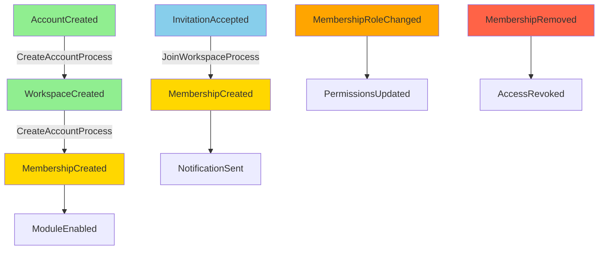

## Mission

Guard the identity / organization / capability context. This package owns accounts, workspaces, memberships, and module registry state. It should remain pure TypeScript and may depend on `@ng-events/core-engine` only.

## Guardrails

- Do not pull Angular, Firebase, or other SDKs into this package.
- Keep task/payment/issue logic in `saas-domain`; this package only decides whether those modules are allowed.
- Follow the saga flow: `AccountCreated` → `WorkspaceCreated` → `MembershipCreated` → `ModuleEnabled`. Compensation uses `AccountSuspended`, `WorkspaceArchived`, `MembershipRemoved`, and module disablement.

## Saga Flow Diagram



### Process Orchestration

**CreateAccountProcess** (Account onboarding):
- Reacts to: `AccountCreated`
- Emits: `CreateWorkspace` → `CreateMembership` commands
- Events: `WorkspaceCreated` → `MembershipCreated`
- Compensation: Delete membership → Archive workspace

**JoinWorkspaceProcess** (Member joins existing workspace):
- Reacts to: `InvitationAccepted`
- Emits: `CreateMembership` → `SendNotification` commands
- Events: `MembershipCreated` → `NotificationSent`
- Compensation: Delete membership → Cancel notification

## Structure Cheatsheet

- `account/` — lifecycle of the SaaS account.
- `workspace/` — world where SaaS modules run.
- `membership/` — user ↔ workspace roles (`Owner | Admin | Member | Viewer`).
- `module-registry/` — enabled capabilities per workspace.
- `__tests__/` — place domain tests alongside aggregates.

## How to extend

Add new value objects, aggregates, or events inside the appropriate module. Keep folders tracked with `.gitkeep` until implementations are ready. Expose new exports via `packages/account-domain/index.ts`.

# account-domain AGENTS.md

## 目標

說明 `account-domain` 的責任範圍、邊界與依賴，方便其他開發者理解和使用。

---

## 目標與責任

- 定義帳號、使用者、組織、角色等核心業務模型  
- 實作 **Entity**、**Value Object (VO)**、**Domain Service**  
- 封裝業務規則、驗證邏輯、不可變概念  
- 提供純領域邏輯給上層或其他 domain 使用

---

## 邊界

- **不依賴** UI (`ui-angular`) 或平台 (`platform-adapters`)  
- 專注於純業務邏輯  
- 可被 `core-engine` 與 `saas-domain` 使用

---

## 依賴圖示 (簡單)

```

account-domain
│
▼
saas-domain
│
▼
ui-angular

```

**說明**：  
- `account-domain` 是最核心的業務模型層  
- `saas-domain` 擴展 account-domain 的概念  
- `ui-angular` 依賴 saas-domain 提供的服務與 API

---

## 原則

1. **不可變與驗證**：VO 與 Entity 必須保持狀態安全  
2. **Domain-first**：業務邏輯在這層，UI/平台只做呈現或橋接  
3. **單一責任**：只聚焦帳號與組織核心概念  
4. **清晰依賴**：不跨界依賴其他 package

